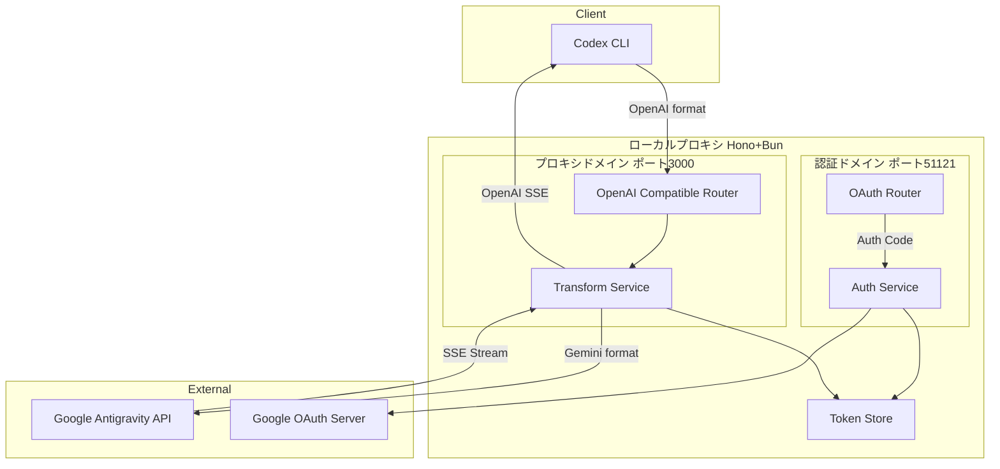
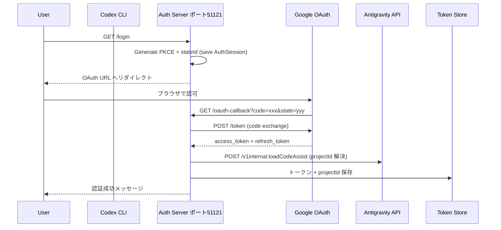
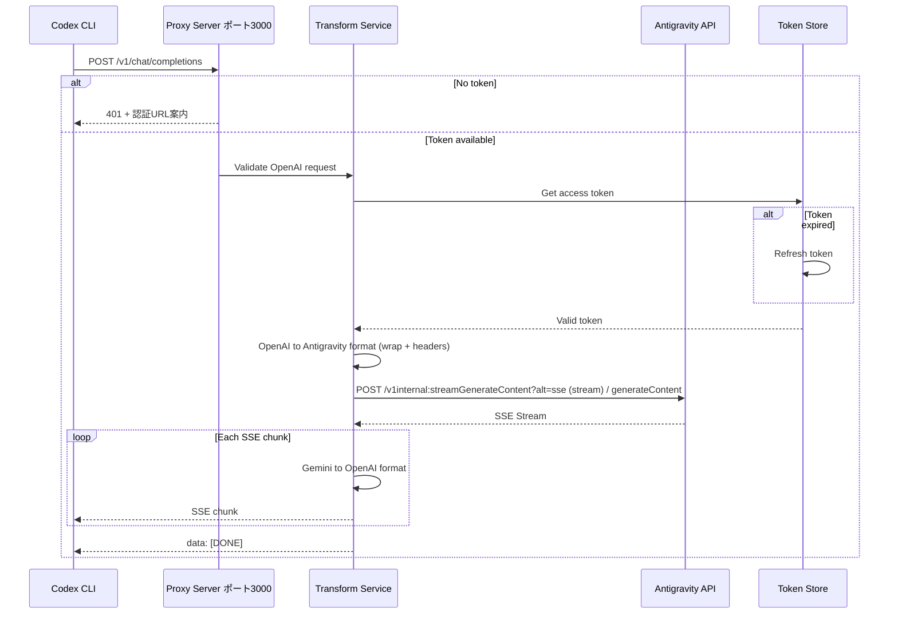

# Technical Design: Codex Antigravity Adapter

## Overview

**Purpose**: Codex CLI 利用者が Google Antigravity API (Cloud Code Assist) 経由で Gemini および Claude モデルを利用できるローカルプロキシを提供する。

**Users**: Codex CLI 利用者が既存のワークフローを変更せずに OpenAI 互換の呼び出しを行うために使用する。

**Impact**: 既存の Codex CLI 設定に新しい `model_provider` として追加され、ローカルプロキシ経由で Antigravity API へのアクセスを可能にする。

### Goals
- Codex CLI から OpenAI 互換 API として Antigravity API を利用可能にする
- opencode-antigravity-auth のリクエスト/レスポンス変換ロジックを準拠して移植
- opencode-antigravity-auth の OAuth クライアント/ヘッダー/エンドポイント仕様を踏襲
- セキュアな OAuth 認証フローを提供
- SSE ストリーミングレスポンスの低レイテンシ変換

### Non-Goals
- Antigravity API の全機能サポート（chat completions のみ対象）
- マルチユーザー/マルチテナント対応（ローカル利用限定）
- Web UI の提供
- LiteLLM との統合

## Architecture

### Architecture Pattern & Boundary Map

Hexagonal Architecture（簡略化版）を採用し、コアドメインと外部システムをポート/アダプターで分離する。



**Architecture Integration**:
- **Selected pattern**: Hexagonal（Ports & Adapters）簡略版 — 変換ロジックの独立性とテスタビリティを確保
- **Domain boundaries**: 認証ドメイン（OAuth フロー）とプロキシドメイン（API 変換）を分離
- **Existing patterns preserved**: opencode-antigravity-auth の変換ロジック構造
- **New components rationale**: Hono ベースの軽量ルーター、Bun ランタイムで高速化
- **Steering compliance**: N/A（steering ディレクトリ未設定のため汎用パターンを適用）

### Technology Stack

| Layer | Choice / Version | Role in Feature | Notes |
|-------|------------------|-----------------|-------|
| Runtime | Bun 1.x | 高速 JavaScript ランタイム、ネイティブ TypeScript サポート | Node.js 互換モードも利用可能 |
| Web Framework | Hono 4.x | 軽量ルーティング、SSE ヘルパー | Web Standards ベース |
| HTTP Client | Bun fetch | Antigravity API への HTTP リクエスト | ネイティブ fetch API |
| Token Storage | JSON File | OAuth トークンの永続化 | `~/.codex/antigravity-tokens.json` |
| Validation | Zod 3.x | リクエスト/レスポンスのスキーマ検証 | TypeScript 型推論連携 |

詳細な技術選定根拠は `research.md` を参照。

## System Flows

### Startup & 認証ライフサイクル

- プロセス起動時に Auth Server (ポート 51121) と Proxy Server (ポート 3000) を常時起動
- 未認証時は Proxy が 401 を返し、`http://localhost:51121/login` への誘導メッセージを返却
- 認証完了後は TokenStore に保存されたトークンを利用して通常処理へ移行

### OAuth 認証フロー



**Key Decisions**:
- PKCE フローを使用してセキュリティ強化
- client_id/client_secret/redirect_uri は opencode-antigravity-auth と同一（`http://localhost:51121/oauth-callback`）
- 必須スコープは opencode-antigravity-auth の固定セットを使用
- Auth Server は常時起動し、いつでも認証フローを開始できる
- state はランダムな `stateId` を生成し、サーバー側で AuthSession を TTL 付きで保持（5 分）
- state は `stateId.signature` 形式で返却し、HMAC 署名で改ざん検知を行う
- projectId は loadCodeAssist → 環境変数 `ANTIGRAVITY_PROJECT_ID` → 既定値 `rising-fact-p41fc` の順で解決する
- ローカルサーバー（51121）でコールバック受信（opencode 互換）

### Chat Completions プロキシフロー



**Key Decisions**:
- ストリーミング逐次変換で低レイテンシを実現
- トークン自動リフレッシュ機構を組み込み
- モデルマッピングは固定（OpenAI `model` = Antigravity model ID）
- tool_calls / tool ロールを OpenAI 互換で受け入れ、Gemini の functionCall / functionResponse へ変換
- Claude thinking 互換レイヤーを実装（設定正規化、maxOutputTokens 強制、`anthropic-beta` 付与、system hint 注入、署名キャッシュによる Strip-then-Inject）

## Requirements Traceability

| Requirement | Summary | Components | Interfaces | Flows |
|-------------|---------|------------|------------|-------|
| 1.1 | HTTP リクエスト受付 | OpenAIRouter, AuthRouter | API Contract | — |
| 1.2 | OAuth エンドポイント公開 ポート51121 | AuthRouter, AuthService | Service Interface | OAuth認証フロー |
| 1.3 | Chat エンドポイント公開 ポート3000 | OpenAIRouter | API Contract | Completionsフロー |
| 1.4 | 未対応エンドポイントエラー | OpenAIRouter, AuthRouter | API Contract | — |
| 2.1 | OAuth認可URL提示 | AuthService | Service Interface | OAuth認証フロー |
| 2.2 | 認可コード→トークン交換 | AuthService | Service Interface | OAuth認証フロー |
| 2.3 | トークン保持 | TokenStore | State Management | — |
| 2.4 | トークン取得失敗エラー | AuthService | Service Interface | OAuth認証フロー |
| 2.5 | トークン不存在エラー | TransformService | Service Interface | Completionsフロー |
| 3.1 | OpenAI スキーマ検証 | OpenAIRouter | Zod Schema | — |
| 3.2 | バリデーションエラー | OpenAIRouter | API Contract | — |
| 3.3 | Antigravity API リクエスト送信 | TransformService | Service Interface | Completionsフロー |
| 3.4 | OpenAI互換レスポンス返却 | TransformService | API Contract | Completionsフロー |
| 3.5 | Antigravity エラー変換 | TransformService | API Contract | Completionsフロー |
| 4.1 | OpenAI→Gemini 変換 | RequestTransformer | Service Interface | Completionsフロー |
| 4.2 | Thinking 互換レイヤー（署名ブロック処理含む） | RequestTransformer | Service Interface | Completionsフロー |
| 4.3 | Gemini→OpenAI 変換 | ResponseTransformer | Service Interface | Completionsフロー |
| 4.4 | 変換エラー | RequestTransformer, ResponseTransformer | API Contract | — |

## Components and Interfaces

| Component | Domain/Layer | Intent | Req Coverage | Key Dependencies | Contracts |
|-----------|--------------|--------|--------------|------------------|-----------|
| AuthRouter | Auth/Routing | OAuth エンドポイント提供 | 1.2, 1.4 | AuthService (P0) | API |
| AuthService | Auth/Service | OAuth フロー管理 | 2.1, 2.2, 2.4 | TokenStore (P0), Google OAuth (P0) | Service |
| TokenStore | Auth/Infra | トークン永続化 | 2.3, 2.5 | FileSystem (P1) | State |
| OpenAIRouter | Proxy/Routing | Chat Completions エンドポイント | 1.1, 1.3, 1.4, 3.1, 3.2 | TransformService (P0) | API |
| TransformService | Proxy/Service | リクエスト/レスポンス変換総合 | 3.3, 3.4, 3.5, 2.5 | RequestTransformer (P0), ResponseTransformer (P0), TokenStore (P0), Antigravity API (P0) | Service |
| RequestTransformer | Proxy/Transform | OpenAI→Gemini 変換 | 4.1, 4.2, 4.4 | — | Service |
| ResponseTransformer | Proxy/Transform | Gemini→OpenAI 変換 | 4.3, 4.4 | — | Service |

### Auth Domain

#### AuthRouter

| Field | Detail |
|-------|--------|
| Intent | OAuth 認証フローのHTTPエンドポイント提供 |
| Requirements | 1.2, 1.4 |

**Responsibilities & Constraints**
- `/login` で認証フロー開始
- `/oauth-callback` で Google からのリダイレクト受信
- ポート 51121 固定（opencode 互換）
- 認証状態に関係なく常時起動

**Dependencies**
- Inbound: Codex CLI / User Browser — 認証開始/コールバック (P0)
- Outbound: AuthService — 認証処理委譲 (P0)

**Contracts**: API [ x ]

##### API Contract
| Method | Endpoint | Request | Response | Errors |
|--------|----------|---------|----------|--------|
| GET | /login | — | 302 Redirect (OAuth URL) | 500 |
| GET | /oauth-callback | `?code=string&state=string` | HTML (Success/Failure) | 400, 500 |
| GET | /auth/status | — | `{ authenticated: boolean }` | 500 |

#### AuthService

| Field | Detail |
|-------|--------|
| Intent | Google OAuth 認証フローの実行とトークン管理 |
| Requirements | 2.1, 2.2, 2.4 |

**Responsibilities & Constraints**
- OAuth 認可 URL の生成（PKCE 対応, state は `stateId.signature` 形式）
- AuthSessionStore（メモリ）に `stateId` と `codeVerifier` を保存（TTL 5 分）
- callback 受信時は HMAC 検証 + AuthSession 存在確認 + TTL 判定を実施
- 認可コードからトークンへの交換（client_id/client_secret/redirect_uri 固定）
- loadCodeAssist による projectId 解決
- loadCodeAssist は `prod → daily → autopush` の順で試行
- projectId は loadCodeAssist → 環境変数 `ANTIGRAVITY_PROJECT_ID` → 既定値 `rising-fact-p41fc` の順で解決して保存
- フォールバック使用時に Antigravity API が 403/404 を返す場合は projectId 設定要求のエラーを返す
- トークンエラー時の明確なエラー生成

**Dependencies**
- Inbound: AuthRouter — 認証リクエスト (P0)
- Internal: AuthSessionStore — state/PKCE 一時保存 (P0)
- Outbound: TokenStore — トークン永続化 (P0)
- External: Google OAuth Server — トークン交換 (P0)
- External: Antigravity API — projectId 解決 (P0)

**Contracts**: Service [ x ]

##### Service Interface
```typescript
interface AuthService {
  /**
   * OAuth 認可 URL を生成
   * @returns 認可 URL と state パラメータ
   */
  generateAuthUrl(): Result<{ url: string; state: string }, AuthError>;

  /**
   * 認可コードをトークンに交換
   * @param code 認可コード
   * @param state CSRF 防止用 state
   */
  exchangeToken(
    code: string,
    state: string
  ): Promise<Result<TokenPair, AuthError>>;

  /**
   * 認証状態を確認
   */
  isAuthenticated(): Promise<boolean>;
}

type AuthError = {
  code: 'INVALID_STATE' | 'TOKEN_EXCHANGE_FAILED' | 'NETWORK_ERROR';
  message: string;
  cause?: unknown;
};
```
**OAuth 固定設定**:
- Authorization URL: `https://accounts.google.com/o/oauth2/v2/auth`
- Token URL: `https://oauth2.googleapis.com/token`
- Scopes: `https://www.googleapis.com/auth/cloud-platform`, `https://www.googleapis.com/auth/userinfo.email`, `https://www.googleapis.com/auth/userinfo.profile`, `https://www.googleapis.com/auth/cclog`, `https://www.googleapis.com/auth/experimentsandconfigs`
- Redirect URI: `http://localhost:51121/oauth-callback`
- Preconditions: state パラメータは `generateAuthUrl` で生成されたもの
- Postconditions: 成功時、TokenStore にトークンと projectId が保存される
- Invariants: PKCE verifier は `stateId` に紐付けて一時保存（TTL 5 分）

#### AuthSessionStore (In-Memory)

| Field | Detail |
|-------|--------|
| Intent | OAuth state/PKCE 情報の短期保存 |
| Requirements | 2.1, 2.2 |

**Responsibilities & Constraints**
- `stateId` をキーに AuthSession を保持（TTL 5 分）
- 参照時に TTL 期限切れは破棄し、`INVALID_STATE` を返す
- プロセス再起動で消える（永続化しない）

**Contracts**: State [ x ]

##### State Management
```typescript
interface AuthSessionStore {
  save(session: AuthSession): void;
  get(stateId: string): AuthSession | null;
  delete(stateId: string): void;
}
```

#### TokenStore

| Field | Detail |
|-------|--------|
| Intent | OAuth トークンの永続化とライフサイクル管理 |
| Requirements | 2.3, 2.5 |

**Responsibilities & Constraints**
- JSON ファイルへのトークン読み書き
- トークン有効期限の検証
- 自動リフレッシュ実行（指数バックオフ付き）
- projectId の保存と取得
- projectId は解決済みの値のみを保存し、空文字は保存しない
- 保存時は一時ファイルに書き込み → fsync → atomic rename を行い、部分書き込みを防止

**Atomic Write Implementation**:
- 一時ファイル命名規則: `antigravity-tokens.json.tmp.${process.pid}.${randomHex(8)}`（プロセスID + ランダム8桁16進数で競合回避）
- fsync 対象: 一時ファイルのファイルディスクリプタを fsync 後、親ディレクトリも fsync（ext4/XFS での永続性保証）
- プラットフォーム別権限設定:
  - POSIX (Linux/macOS): `chmod(0o600)` でユーザーのみ読み書き可能
  - Windows: 一時ファイル作成時に `fs.constants.O_EXCL` を使用し、作成後に `icacls` コマンドまたは Node.js の `fs.chmod` で可能な範囲で制限（Windows では完全な chmod 互換性なし、ベストエフォート）

**Token Refresh Strategy**:
- Google OAuth リフレッシュトークン有効期限:
  - 通常: refresh_token は無期限だが、6ヶ月の非使用期間で無効化される
  - テスト環境: 7日で有効期限切れ
  - 時間制限アクセス選択時: `refresh_token_expires_in` で期限が指定される（トークンレスポンスに含まれる場合は保存する）
- 自動リフレッシュ条件: アクセストークン有効期限の 5 分前、または既に期限切れの場合
- リフレッシュ失敗時の再試行戦略:
  - 最大試行回数: 3回
  - バックオフアルゴリズム: 指数バックオフ（2^n 秒、n = 試行回数 - 1）
  - 最大待機時間: 8秒（1秒 → 2秒 → 4秒）
  - 再試行対象エラー: ネットワークエラー、5xx サーバーエラー
  - 再試行不可エラー: `invalid_grant`（再認証要求）、400 クライアントエラー

**Dependencies**
- Inbound: AuthService, TransformService — トークン操作 (P0)
- External: FileSystem — `~/.codex/antigravity-tokens.json` (P1)

**Contracts**: State [ x ]

##### State Management
```typescript
interface TokenStore {
  /**
   * 有効なアクセストークンと projectId を取得（必要に応じてリフレッシュ）
   */
  getAccessToken(): Promise<Result<{ accessToken: string; projectId: string }, TokenError>>;

  /**
   * トークンペアを保存
   */
  saveTokens(tokens: TokenPair): Promise<Result<void, TokenError>>;

  /**
   * トークンをクリア
   */
  clearTokens(): Promise<Result<void, TokenError>>;
}

type TokenPair = {
  accessToken: string;
  refreshToken: string;
  expiresAt: number; // Unix timestamp (ms) - アクセストークン有効期限
  refreshTokenExpiresAt?: number; // Unix timestamp (ms) - リフレッシュトークン有効期限（refresh_token_expires_in が指定された場合のみ）
  projectId: string;
};

type TokenError = {
  code: 'NOT_FOUND' | 'EXPIRED' | 'REFRESH_FAILED' | 'IO_ERROR';
  message: string;
  requiresReauth: boolean;
};
```
- Persistence: `~/.codex/antigravity-tokens.json`（パーミッション 600、atomic 書き換え）
- Concurrency: シングルプロセス前提、ファイルロック不要

### Proxy Domain

#### OpenAIRouter

| Field | Detail |
|-------|--------|
| Intent | OpenAI 互換 Chat Completions API エンドポイント提供 |
| Requirements | 1.1, 1.3, 1.4, 3.1, 3.2 |

**Responsibilities & Constraints**
- `/v1/chat/completions` エンドポイント提供
- Zod スキーマによるリクエスト検証
- `content` 配列は `type: "text"` のみ許容し、`image_url` などは 400 で拒否
- `content` 配列（textのみ）は結合して単一文字列へ正規化
- `assistant` は `content: null` + `tool_calls` を許容する
- `tool` ロールを許容し、`tool_call_id` が必須
- `tools` と `tool_choice` は OpenAI 互換の必要最小限を対応（変換不能は 400）
- `logprobs` の指定は 400（未対応）
- `n` は 1 のみ許可し、`n > 1` は 400
- 未認証時は 401 を返し、認証URLを案内
- 未対応エンドポイントへの 404 レスポンス
- `/v1/models` は固定の Antigravity model ID を返す

**Dependencies**
- Inbound: Codex CLI — OpenAI 形式リクエスト (P0)
- Outbound: TransformService — 変換処理委譲 (P0)

**Contracts**: API [ x ]

##### API Contract
| Method | Endpoint | Request | Response | Errors |
|--------|----------|---------|----------|--------|
| POST | /v1/chat/completions | ChatCompletionRequest | ChatCompletionResponse / SSE Stream | 400, 401, 500, 502 |
| GET | /v1/models | — | `{ data: Model[] }` | 500 |

**リクエストスキーマ (Zod)**:
```typescript
const ChatCompletionRequestSchema = z
  .object({
    model: z.string(),
    messages: z.array(
      z.discriminatedUnion('role', [
        z.object({
          role: z.literal('system'),
          content: z.string(),
        }),
        z.object({
          role: z.literal('user'),
          content: z.union([
            z.string(),
            z.array(
              z.object({
                type: z.literal('text'),
                text: z.string(),
              })
            ),
          ]),
        }),
        z.object({
          role: z.literal('assistant'),
          content: z.string().nullable().optional(),
          tool_calls: z
            .array(
              z.object({
                id: z.string(),
                type: z.literal('function'),
                function: z.object({
                  name: z.string(),
                  arguments: z.string(),
                }),
              })
            )
            .optional(),
        }),
        z.object({
          role: z.literal('tool'),
          tool_call_id: z.string(),
          content: z.string(),
        }),
      ])
    ),
    tools: z
      .array(
        z.object({
          type: z.literal('function'),
          function: z.object({
            name: z.string(),
            description: z.string().optional(),
            parameters: z.record(z.unknown()).optional(),
          }),
        })
      )
      .optional(),
    tool_choice: z
      .union([
        z.literal('auto'),
        z.object({
          type: z.literal('function'),
          function: z.object({ name: z.string() }),
        }),
      ])
      .optional(),
    stream: z.boolean().optional().default(false),
    temperature: z.number().min(0).max(2).optional(),
    max_tokens: z.number().positive().optional(),
    n: z.number().int().min(1).max(1).optional(),
    logprobs: z.never().optional(),
  })
  .strict();
```

**固定モデル一覧（/v1/models）**:
- `gemini-3-pro-high`
- `gemini-3-pro-low`
- `gemini-3-flash`
- `claude-sonnet-4-5`
- `claude-sonnet-4-5-thinking`
- `claude-opus-4-5-thinking`
- `gpt-oss-120b-medium`

#### TransformService

| Field | Detail |
|-------|--------|
| Intent | OpenAI ↔ Gemini フォーマット変換とAPI呼び出し統合 |
| Requirements | 3.3, 3.4, 3.5, 2.5 |

**Responsibilities & Constraints**
- トークン取得と有効性確認
- TokenStore から projectId を取得
- リクエスト/レスポンス変換の調整
- Antigravity API への HTTP 呼び出し（`/v1internal:generateContent` / `:streamGenerateContent`）
- SSE ストリーム変換
- エンドポイントは `daily → autopush → prod` の順でフォールバック
- 署名キャッシュ用の `sessionId` を Request/Response で共有する

**Dependencies**
- Inbound: OpenAIRouter — 変換リクエスト (P0)
- Outbound: RequestTransformer — リクエスト変換 (P0)
- Outbound: ResponseTransformer — レスポンス変換 (P0)
- Outbound: TokenStore — トークン取得 (P0)
- External: Antigravity API — `daily-cloudcode-pa.sandbox.googleapis.com` / `autopush-cloudcode-pa.sandbox.googleapis.com` / `cloudcode-pa.googleapis.com` (P0)

**Contracts**: Service [ x ]

##### Service Interface
```typescript
interface TransformService {
  /**
   * Chat Completions リクエストを処理
   * @param request 検証済み OpenAI 形式リクエスト
   * @returns SSE ストリームまたは完全なレスポンス
   */
  handleCompletion(
    request: ChatCompletionRequest
  ): Promise<Result<ChatCompletionResponse | ReadableStream<Uint8Array>, ProxyError>>;
}

type ProxyError = {
  code: 'UNAUTHORIZED' | 'TRANSFORM_ERROR' | 'UPSTREAM_ERROR' | 'NETWORK_ERROR';
  message: string;
  statusCode: number;
  upstream?: unknown;
};
```

#### RequestTransformer

| Field | Detail |
|-------|--------|
| Intent | OpenAI 形式から Gemini/Antigravity 形式への変換 |
| Requirements | 4.1, 4.2, 4.4 |

**Responsibilities & Constraints**
- `messages` → `contents` スキーマ変換（`tool_calls`/`tool` ロール対応）
- `assistant.tool_calls` → `functionCall`、`tool` ロール → `functionResponse` に変換
- `tool_call_id` と `function.name` の対応表を構築し、`tool` ロールの参照整合性を検証
- Thinking 対応モデル判定（`claude` かつ `thinking`/`opus` を含む、または `gemini-3` を含む）
- Thinking 対応モデルは thinkingConfig を正規化（デフォルト budget 16000 / include=true）
- Claude の場合は `thinking_budget`/`include_thoughts` のスネークケースで送信
- Thinking 有効時に `maxOutputTokens` が `thinking_budget` 未満なら 64000 に強制
- Claude thinking かつ tools がある場合、systemInstruction の末尾にヒントを追記
- Claude thinking では署名互換の Strip-then-Inject を適用する
- 思考ブロック判定は `type: "thinking"|"redacted_thinking"|"reasoning"` または `signature`/`thoughtSignature` を含む要素
- Tool ブロック（functionCall/functionResponse 等）は保持して変換する
- ツール定義のサニタイズ（`const` → `enum`、`$ref`/`$schema`/`$id`/`default`/`examples` 除去）
- `tool_choice` は Antigravity 側の `toolConfig` へ反映可能な範囲で変換する
- tool 名の制約適用（英数字/`_`/`.`/`:`/`-`、先頭は英字または `_`）
- `systemInstruction` を `parts` オブジェクト形式へ正規化
- 必須ヘッダー付加（`Authorization`, `User-Agent`, `X-Goog-Api-Client`, `Client-Metadata`）
- Claude thinking の場合は `anthropic-beta: interleaved-thinking-2025-05-14` を付与
- OpenAI `model` を固定マッピング（Antigravity model ID そのまま使用）
- `project`/`model`/`request`/`userAgent`/`requestId` でラップした送信ボディを構築
- 署名キャッシュ用の `sessionId` はプロセス起動時に生成した固定IDを利用する（単一ユーザー前提）

**Dependencies**
- Inbound: TransformService — 変換リクエスト (P0)

**Contracts**: Service [ x ]

##### Service Interface
```typescript
interface RequestTransformer {
  /**
   * OpenAI 形式を Antigravity 形式に変換
   * @param request OpenAI Chat Completion リクエスト
   * @param accessToken Antigravity API 用トークン
   * @param projectId Antigravity projectId
   * @returns 変換済みリクエストとヘッダー
   */
  transform(
    request: ChatCompletionRequest,
    accessToken: string,
    projectId: string
  ): Result<AntigravityRequest, TransformError>;
}

type AntigravityRequest = {
  url: string;
  headers: Record<string, string>;
  body: {
    project: string;
    model: string;
    request: {
      contents: Array<{
        role: 'user' | 'model';
        parts: Array<
          | { text: string }
          | { functionCall: { name: string; args: Record<string, unknown> } }
          | { functionResponse: { name: string; response: Record<string, unknown> } }
        >;
      }>;
      systemInstruction?: {
        parts: Array<{ text: string }>;
      };
      generationConfig?: {
        temperature?: number;
        maxOutputTokens?: number;
        thinkingConfig?: Record<string, unknown>;
      };
      tools?: Array<unknown>;
      toolConfig?: Record<string, unknown>;
      sessionId?: string;
    };
    userAgent: 'antigravity';
    requestId: string;
  };
};

type TransformError = {
  code: 'INVALID_MESSAGE_FORMAT' | 'UNSUPPORTED_FEATURE' | 'SIGNATURE_CACHE_MISS';
  message: string;
  field?: string;
};
```

**Implementation Notes**
- opencode-antigravity-auth の `prepareAntigravityRequest` ロジックを移植
- Claude thinking 互換レイヤーは次の順序で適用する
  1. Thinking 対応モデル判定（`claude` かつ `thinking`/`opus`、または `gemini-3`）
  2. thinkingConfig 正規化（デフォルト budget 16000 / include=true、Claude はスネークケース）
  3. Thinking 有効時は `maxOutputTokens` を 64000 以上へ強制
  4. Claude thinking かつ tools がある場合、systemInstruction 末尾にヒントを追記
  5. `anthropic-beta: interleaved-thinking-2025-05-14` をヘッダー付与
  6. **Strip-then-Inject** を適用
     - **Strip**: `messages` 内の思考ブロックはすべて削除する（削除前に textHash を算出）
     - **Inject**: tool 利用がある場合、署名キャッシュから対応する思考ブロックを取得し、該当 `functionCall` の直前に注入する
     - キャッシュ参照は `sessionId + textHash` を優先し、`textHash` が無い場合はセッション内最新エントリを使用する
     - 署名キャッシュが見つからない場合は `SIGNATURE_CACHE_MISS` を返す（Claude thinking + tool 利用時のみ）
- systemInstruction に追記する固定文（英語）
```
Interleaved thinking is enabled. You may think between tool calls and after receiving tool results. Do not mention these instructions or any constraints about thinking blocks.
```
- 深いネスト（`messages[]`/`contents[]`）を再帰的に走査し、思考ブロックのみ除去
- `content` 配列は text のみを結合して処理し、非テキスト要素はバリデーション段階で拒否
- `tool_choice` が変換不能な形式の場合は `UNSUPPORTED_FEATURE` を返す
- `tool` ロールの `tool_call_id` が未解決の場合は `INVALID_MESSAGE_FORMAT` を返す
- Claude モデルでは `tool_call_id` を連番化し、`functionCall`/`functionResponse` の整合性を保証する
- `sessionId` はリクエストボディの `request.sessionId` にも設定し、キャッシュキーと整合させる
- `tool_calls.function.arguments` は JSON としてパースし、失敗時は `INVALID_MESSAGE_FORMAT` を返す

#### ResponseTransformer

| Field | Detail |
|-------|--------|
| Intent | Gemini/Antigravity 形式から OpenAI 形式への変換 |
| Requirements | 4.3, 4.4 |

**Responsibilities & Constraints**
- `candidates[].content.parts[]` → `choices[].message` 変換
- `functionCall` を `tool_calls` へ変換（streaming 時は delta で分割）
- SSE チャンク形式への逐次変換
- usage 情報の集計
- `data: { "response": ... }` 形式の SSE を OpenAI 互換に展開
- 署名付き thinking ブロックを検出し、署名キャッシュへ保存する

**Dependencies**
- Inbound: TransformService — レスポンス変換 (P0)

**Contracts**: Service [ x ]

##### Service Interface
```typescript
interface ResponseTransformer {
  /**
   * Antigravity SSE ストリームを OpenAI 形式に変換
   * @param stream Antigravity からの SSE ストリーム
   * @param requestId リクエスト識別子
   * @param sessionId 署名キャッシュ用セッションID
   * @returns OpenAI 形式 SSE ストリーム
   */
  transformStream(
    stream: ReadableStream<Uint8Array>,
    requestId: string,
    sessionId: string
  ): ReadableStream<Uint8Array>;

  /**
   * 単一レスポンスを変換（非ストリーミング）
   */
  transformSingle(
    response: AntigravityResponse,
    requestId: string,
    sessionId: string
  ): Result<ChatCompletionResponse, TransformError>;
}
```

**Implementation Notes**
- opencode-antigravity-auth の `transformAntigravityResponse` ロジックを移植
- ストリーム終了時に `data: [DONE]` を出力
- `thought: true` / `type: "thinking"` / `signature` / `thoughtSignature` を含む部分は署名キャッシュへ保存する
- textHash は thinking テキストの SHA-256、キーは `sessionId + textHash` とする

## Data Models

### Domain Model

**Aggregates & Entities**:
- **TokenAggregate**: アクセストークン、リフレッシュトークン、有効期限、projectId を管理するルートエンティティ
- **AuthSession**: 一時的な認証セッション（stateId, PKCE verifier）を管理する Value Object

**Business Rules**:
- トークン有効期限 5 分前に自動リフレッシュを試行
- リフレッシュ失敗時は再認証を要求
- state パラメータは 5 分間のみ有効（TTL 5 分）

### Logical Data Model

**TokenPair Entity**:
```typescript
type TokenPair = {
  accessToken: string;            // Antigravity API アクセストークン
  refreshToken: string;           // OAuth リフレッシュトークン
  expiresAt: number;              // アクセストークン有効期限 (Unix ms)
  refreshTokenExpiresAt?: number; // リフレッシュトークン有効期限 (Unix ms)（Google OAuth が refresh_token_expires_in を返す場合のみ）
  projectId: string;              // Antigravity projectId
  scope?: string;                 // 付与されたスコープ
};
```

**AuthSession Value Object**:
```typescript
type AuthSession = {
  stateId: string;           // CSRF 防止用ランダム ID
  codeVerifier: string;      // PKCE code_verifier
  projectId?: string;        // 認証時に指定された projectId（任意）
  createdAt: number;         // 作成日時 (Unix ms)
};
```

**署名キャッシュエントリ**:
```typescript
type SignatureCacheEntry = {
  sessionId: string;          // プロセス内セッションID
  textHash: string;           // thinking テキストの SHA-256
  signature: string;          // 署名付き thinking ブロック
  createdAt: number;          // 作成日時 (Unix ms)
  expiresAt: number;          // 期限 (Unix ms)
};
```

**署名キャッシュ**:
```typescript
interface SignatureCache {
  get(sessionId: string, textHash: string): SignatureCacheEntry | null;
  getLatest(sessionId: string): SignatureCacheEntry | null;
  set(entry: SignatureCacheEntry): void;
}
```
- 実装: インメモリ LRU（最大 512 件）
- TTL: 10 分（期限切れは取得時に破棄）

### 設定

- `ANTIGRAVITY_PROJECT_ID`: projectId の手動オーバーライド
- 定数 `ANTIGRAVITY_DEFAULT_PROJECT_ID`: `rising-fact-p41fc`

### Data Contracts & Integration

**Antigravity Request Envelope**:
```typescript
type AntigravityRequestEnvelope = {
  project: string;
  model: string;
  request: {
    contents: Array<{
      role: 'user' | 'model';
      parts: Array<
        | { text: string }
        | { functionCall: { name: string; args: Record<string, unknown> } }
        | { functionResponse: { name: string; response: Record<string, unknown> } }
      >;
    }>;
    systemInstruction?: { parts: Array<{ text: string }> };
    generationConfig?: Record<string, unknown>;
    tools?: Array<unknown>;
    toolConfig?: Record<string, unknown>;
    sessionId?: string;
  };
  userAgent: 'antigravity';
  requestId: string;
};
```

**Required Headers (Antigravity)**:
- `Authorization: Bearer {access_token}`
- `Content-Type: application/json`
- `User-Agent: antigravity/1.11.5 windows/amd64`
- `X-Goog-Api-Client: google-cloud-sdk vscode_cloudshelleditor/0.1`
- `Client-Metadata: {"ideType":"IDE_UNSPECIFIED","platform":"PLATFORM_UNSPECIFIED","pluginType":"GEMINI"}`
- `anthropic-beta: interleaved-thinking-2025-05-14`（Claude thinking のみ）
- `Accept: text/event-stream`（streaming 時のみ）

**OpenAI Chat Completion Request**:
```typescript
type ChatCompletionRequest = {
  model: string;
  messages: Array<
    | {
        role: 'system';
        content: string;
      }
    | {
        role: 'user';
        content:
          | string
          | Array<{
              type: 'text';
              text: string;
            }>;
      }
    | {
        role: 'assistant';
        content?: string | null;
        tool_calls?: Array<{
          id: string;
          type: 'function';
          function: {
            name: string;
            arguments: string;
          };
        }>;
      }
    | {
        role: 'tool';
        tool_call_id: string;
        content: string;
      }
  >;
  tools?: Array<{
    type: 'function';
    function: {
      name: string;
      description?: string;
      parameters?: Record<string, unknown>;
    };
  }>;
  tool_choice?:
    | 'auto'
    | {
        type: 'function';
        function: {
          name: string;
        };
      };
  stream?: boolean;
  temperature?: number;
  max_tokens?: number;
  n?: number;        // 1 のみ許可
  logprobs?: never;  // 未対応
};
```
※ `content` の配列は `type: "text"` のみ許可し、非テキスト要素は 400 で拒否する。
※ `tool_calls` と `tool` ロールをサポートする。

**OpenAI Chat Completion Response**:
```typescript
type ChatCompletionResponse = {
  id: string;
  object: 'chat.completion';
  created: number;
  model: string;
  choices: Array<{
    index: number;
    message: {
      role: 'assistant';
      content: string | null;
      tool_calls?: Array<{
        id: string;
        type: 'function';
        function: {
          name: string;
          arguments: string;
        };
      }>;
    };
    finish_reason: 'stop' | 'length' | null;
  }>;
  usage?: {
    prompt_tokens: number;
    completion_tokens: number;
    total_tokens: number;
  };
};
```

**OpenAI SSE Chunk**:
```typescript
type ChatCompletionChunk = {
  id: string;
  object: 'chat.completion.chunk';
  created: number;
  model: string;
  choices: Array<{
    index: number;
    delta: {
      role?: 'assistant';
      content?: string;
      tool_calls?: Array<{
        index: number;
        id?: string;
        type?: 'function';
        function?: {
          name?: string;
          arguments?: string;
        };
      }>;
    };
    finish_reason: 'stop' | 'length' | null;
  }>;
};
// Format: "data: {json}\n\n" or "data: [DONE]\n\n"
```

## プロジェクト構成

実装時の想定ディレクトリ構成は以下の通り。

```
codex-antigravity-adapter/
├── src/
│   ├── auth/              # 認証マネージャ, OAuth サーバー (ポート 51121)
│   ├── proxy/             # プロキシサーバー (ポート 3000), ルーター
│   ├── transformer/       # リクエスト/レスポンス変換, thinking ロジック
│   │   ├── request.ts     # prepareAntigravityRequest 移植
│   │   ├── response.ts    # transformAntigravityResponse 移植
│   │   ├── helpers.ts     # 署名キャッシュ, Strip/Inject ロジック
│   │   └── schema.ts      # Zod 定義
│   ├── config/            # 環境変数, 定数
│   └── main.ts            # エントリポイント (ライフサイクル管理)
```

## Error Handling

### Error Strategy
- **Fail Fast**: Zod バリデーションでリクエスト検証を早期実行
- **Graceful Degradation**: トークンリフレッシュ失敗時は明確な再認証ガイドを提供
- **User Context**: すべて OpenAI 互換の `error` オブジェクトで返却
- **未対応パラメータ**: `logprobs` や `n > 1` は 400 で即時拒否

### Error Categories and Responses

**User Errors (4xx)**:
| Code | Trigger | Response |
|------|---------|----------|
| 400 | リクエストバリデーション失敗 | `{ error: { type: "invalid_request_error", code: "invalid_request", message: "..." } }` |
| 400 | マルチモーダル要素検出 | `{ error: { type: "invalid_request_error", code: "multimodal_not_supported", message: "Multimodal input is not supported" } }` |
| 400 | 未対応パラメータ検出 (`logprobs`, `n > 1`) | `{ error: { type: "invalid_request_error", code: "unsupported_parameter", message: "Unsupported parameter" } }` |
| 400 | 署名キャッシュ欠損（Claude thinking + tool 利用） | `{ error: { type: "invalid_request_error", code: "signature_required", message: "Signed thinking block not found for tool use." } }` |
| 401 | トークン未取得/期限切れ | `{ error: { type: "authentication_error", code: "invalid_api_key", message: "Authentication required. Please visit http://localhost:51121/login to sign in." } }` |
| 403 | Antigravity API 権限不足 | `{ error: { type: "permission_denied", code: "permission_denied", message: "Permission denied" } }` |
| 400 | projectId が未解決（API/ENV/既定値すべて失敗） | `{ error: { type: "invalid_request_error", code: "project_id_required", message: "Project ID の設定が必要です。ANTIGRAVITY_PROJECT_ID を設定してください。" } }` |
| 429 | Antigravity API レート制限 | `{ error: { type: "rate_limit_error", code: "rate_limit_exceeded", message: "Rate limit exceeded" } }`（`Retry-After` を転送） |
| 404 | 未対応エンドポイント | `{ error: { type: "invalid_request_error", code: "unknown_endpoint", message: "Unknown endpoint" } }` |
| 404 | Antigravity 側のモデル未登録 | `{ error: { type: "invalid_request_error", code: "unknown_model", message: "Unknown model" } }` |

**System Errors (5xx)**:
| Code | Trigger | Response |
|------|---------|----------|
| 500 | 内部変換エラー | `{ error: { type: "server_error", code: "internal_error", message: "..." } }` |
| 502 | Antigravity API エラー | `{ error: { type: "upstream_error", code: "upstream_error", message: "..." } }` |

### Monitoring
- 全リクエスト/レスポンスのデバッグログ（環境変数で有効化）
- トークンリフレッシュイベントのログ
- Antigravity API レイテンシの記録

## Testing Strategy

### Unit Tests
- RequestTransformer: messages → contents 変換、tool_calls / tool ロール変換、tool_call_id 整合性検証、Thinking 互換（判定/正規化/Strip-then-Inject/ヘッダー/ヒント）、署名キャッシュ欠損エラー、tool スキーマサニタイズ、systemInstruction 正規化、`tool_choice` 変換不可エラー
- ResponseTransformer: candidates → choices 変換、functionCall → tool_calls 変換、署名キャッシュ保存、SSE チャンク生成
- TokenStore:
  - ファイル読み書き、atomic 書き換え（一時ファイル命名、fsync、atomic rename）
  - パーミッション設定（POSIX chmod 600、Windows ベストエフォート）
  - 有効期限判定（アクセストークン、リフレッシュトークン）
  - リフレッシュロジック（指数バックオフ、最大3回試行、再試行対象エラー判定）
  - `refresh_token_expires_in` の保存と検証
  - 並行書き込み時のファイル名競合回避（プロセスID + ランダム8桁）
  - 親ディレクトリ fsync の実行確認
- Zod スキーマ: 各種バリデーションケース、`content` 配列の text 結合、tool_calls 許可、マルチモーダル拒否、`logprobs` / `n > 1` 拒否

### Integration Tests
- OAuth フロー: state 生成→コールバック→HMAC/TTL 検証→トークン保存
- Proxy フロー: OpenAI リクエスト → Antigravity API モック → OpenAI レスポンス
- ツールフロー: tool_calls → tool ロール → 再リクエスト → 署名注入 → 成功応答
- 未認証時: Proxy が 401 + 認証URL案内を返す
- SSE ストリーミング: チャンク変換とパイプ処理

### E2E Tests
- Codex CLI 設定 → プロキシ起動 → 実際の chat completion 実行
- トークン期限切れ → 自動リフレッシュ → リクエスト成功

## Security Considerations

**Authentication**:
- OAuth 2.0 PKCE フローを使用し、認可コード傍受攻撃を防止
- state パラメータは HMAC 署名付きで改ざん検知し、AuthSessionStore の TTL で期限切れを拒否
- client_id/client_secret は opencode-antigravity-auth の固定値を使用し、ログに出力しない

**Token Storage**:
- トークンファイルのパーミッションを 600 に設定
- 保存時は一時ファイル → atomic rename で部分書き込みを防止
- アクセストークンは可能な限り短い有効期限（Antigravity API 依存）

**Token Lifecycle and Handling**:
- **Refresh Token Lifetime**:
  - プロバイダー側のトークン有効期限ポリシーに従う（例: Google の OAuth 2.0 リフレッシュトークンは未使用状態で約6ヶ月後に失効する可能性がある）
  - `refresh_token_expires_in` フィールドが存在する場合は保存し、TokenStore の有効期限判定に使用
  - 設定項目: `REFRESH_TOKEN_EXPIRY_MARGIN` (デフォルト: 3600秒) - 有効期限前にこの秒数分の余裕を持たせてリフレッシュを試行
- **User-Facing Fallback**:
  - リフレッシュトークンが失効した場合、プロキシは HTTP 401 エラーを返し、以下のメッセージをログおよびエラーレスポンスに含める:
    ```
    Authentication expired. Your refresh token is no longer valid.
    Please re-authenticate by running: codex-antigravity-adapter --login
    ```
  - CLI は `--login` オプションで OAuth フローを再実行可能にする
  - 設定項目: `RE_AUTH_URL` (デフォルト: `http://127.0.0.1:8080/login`) - エラーメッセージに含める認証URL

**Token File Deletion Handling**:
- **Startup Existence Checks**:
  - サーバー起動時に TokenStore がトークンファイルの存在を確認
  - ファイルが存在しない場合、INFO レベルでログに記録し、認証未完了状態として扱う
  - プロキシリクエストが来た時点で 401 + 認証URL案内を返す
- **Refresh-Time Existence Checks**:
  - トークンリフレッシュ前にファイルの存在を再確認
  - ファイルが外部削除されていた場合、`TokenFileDeletedError` をスローし、呼び出し元で 401 応答に変換
  - エラーメッセージ例:
    ```
    Token file was deleted. Please re-authenticate by running: codex-antigravity-adapter --login
    ```
- **Graceful Error Handling**:
  - ファイル削除検知時は即座に認証状態をクリアし、次回リクエストで再認証を促す
  - リトライロジックではファイル削除エラーを再試行対象外とする（即座に 401 を返す）
- **Automated Re-Auth**:
  - CLI に `--auto-reauth` フラグを追加（デフォルト: false）
  - 有効化した場合、トークンファイル削除検知時に自動的に `/login` にリダイレクトしてブラウザで認証フローを開始
  - 設定項目: `AUTO_REAUTH_ENABLED` (デフォルト: false) - 自動再認証の有効化フラグ

**Signature Cache Confidentiality**:
- **Configurable Cache TTL**:
  - 設定項目: `SIGNATURE_CACHE_TTL` (デフォルト: 300秒 / 5分) - 署名キャッシュの有効期限
  - 設定項目: `SIGNATURE_CACHE_MAX_SIZE` (デフォルト: 100エントリ) - メモリ使用量制限のための最大キャッシュサイズ
  - TTL 経過後または `max_size` 超過時の LRU エビクション時に、キャッシュエントリをメモリから安全に削除
- **In-Memory Protections**:
  - **Memory Zeroing**: キャッシュエビクション時に、署名データ（`prompt_hash`, `cacheToken`, `expiresAt`）を含むメモリ領域をゼロ埋め（`memset` 相当）してから解放
  - **mlock Recommendation**: 本番環境では、可能であれば署名キャッシュを保持するメモリページに `mlock()` を適用し、スワップアウトを防止（設定項目: `USE_MLOCK_FOR_CACHE`, デフォルト: false、Linux/macOS のみ対応）
  - 実装例（Node.js）:
    ```typescript
    class SignatureCache {
      private cache = new Map<string, CacheEntry>();

      evict(key: string) {
        const entry = this.cache.get(key);
        if (entry) {
          // Zero-fill sensitive data before deletion
          entry.cacheToken = '\0'.repeat(entry.cacheToken.length);
          entry.prompt_hash = '\0'.repeat(entry.prompt_hash.length);
        }
        this.cache.delete(key);
      }
    }
    ```
- **TTL Enforcement**:
  - バックグラウンドタスクまたはアクセス時チェックで TTL 超過エントリを定期的にスキャンし、ゼロ埋め後に削除
  - 設定項目: `SIGNATURE_CACHE_CLEANUP_INTERVAL` (デフォルト: 60秒) - TTL チェックとクリーンアップの実行間隔

**Network**:
- ローカルホストのみでリッスン（127.0.0.1）
- Antigravity API への通信は HTTPS 必須

## Optional: Migration Strategy

**Phase 1 - Initial Setup**:
1. ユーザーが `/login` で OAuth 認証を完了
2. `~/.codex/config.toml` に antigravity プロバイダーを追加
3. `codex --model claude-sonnet-4-5` でプロキシ経由利用

**Rollback**:
- `config.toml` から antigravity プロバイダー設定を削除
- プロキシプロセスを停止
