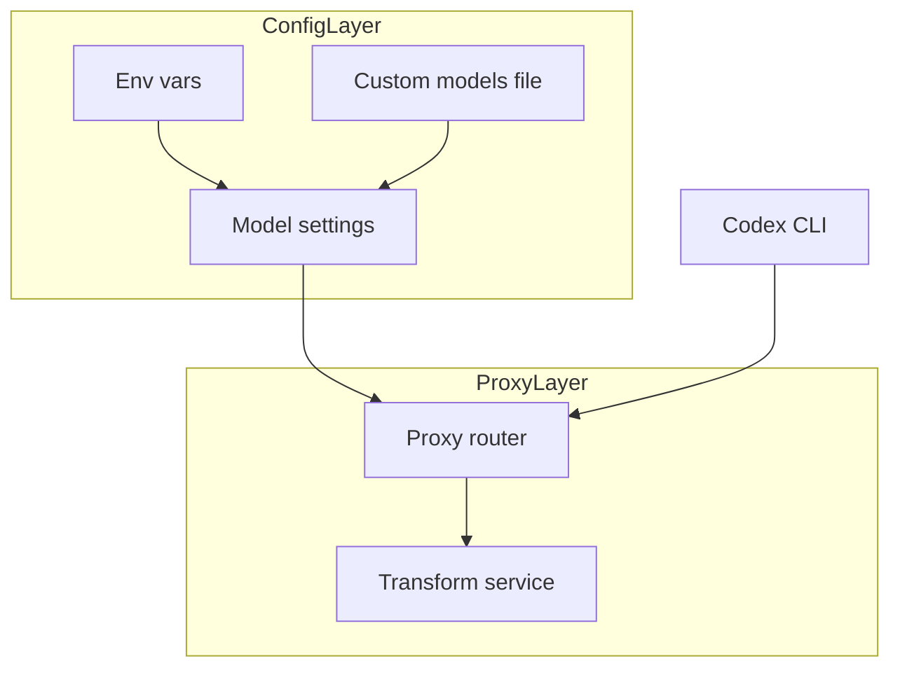
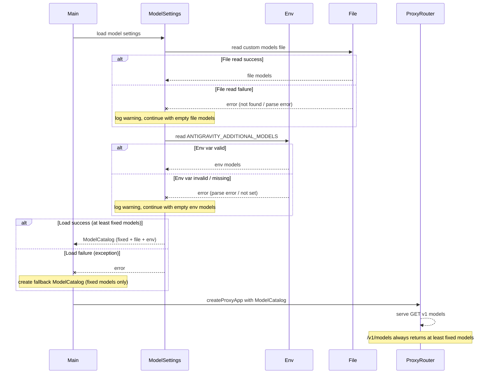

# 技術設計書: codex-cli-model-display

## Overview
**Purpose**: Codex CLI 利用者が再ビルドなしでモデル ID を追加できるよう、`/v1/models` のモデル一覧を設定ベースで拡張する。  
**Users**: Codex CLI を使う開発者が、プロジェクト固有のモデル ID を登録するワークフローで使用する。  
**Impact**: `proxy-router.ts` の固定リスト参照を、起動時にロードしたモデル設定の注入に置き換える。

### Goals
- 環境変数と設定ファイルから追加モデルを読み込み、固定モデルと統合する
- 設定エラー時でも起動と `/v1/models` を継続可能にする
- OpenAI 互換のモデルリスト形式を維持する

### Non-Goals
- 動的なモデル一覧取得（API 不在）
- モデルメタデータ（capabilities、pricing など）の管理
- 設定のホットリロード

## Requirements Traceability

| Requirement | Summary | Components | Interfaces | Flows |
|-------------|---------|------------|------------|-------|
| 1.1 | 環境変数からモデル ID を取得 | ModelSettingsService | load | 起動時ロード |
| 1.2 | 設定ファイルからモデル ID を取得 | ModelSettingsService | load | 起動時ロード |
| 1.3 | 無効設定は警告ログで無視 | ModelSettingsService | load | 起動時ロード |
| 2.1 | 固定 + 追加モデルの統合 | ModelSettingsService | load | 起動時ロード |
| 2.2 | ID ベースの重複排除 | ModelSettingsService | load | 起動時ロード |
| 2.3 | `/v1/models` のレスポンス形式維持 | ProxyRouter | GET v1 models | API 応答 |
| 3.1 | README 更新 | Documentation | - | - |

## Architecture

### Existing Architecture Analysis
- `/v1/models` は `src/proxy/proxy-router.ts` の `FIXED_MODEL_IDS` を直接参照している
- 起動時の DI は `src/main.ts` に集約され、`createProxyApp` に依存を注入している
- `src/config/` 配下に環境変数読み込みの既存パターンがある

### Architecture Pattern & Boundary Map



**Architecture Integration**:
- Selected pattern: 設定モジュール分離 + DI 注入（責務分離とテスト容易性を優先）
- Domain/feature boundaries: Config は設定読み込みと統合、Proxy は HTTP 応答のみ
- Existing patterns preserved: `createProxyApp` を中心とした DI、`config` モジュールの分離
- New components rationale: `ModelSettingsService` で設定読み込みを一元化する
- Composition root: 起動時に `ModelSettingsService` を非同期ロードし、`ModelCatalog` を `createProxyApp` に注入する
- **Backward compatibility strategy for `createProxyApp` signature**:
  - **Options considered**: (1) `modelCatalog` をオプショナルパラメータにしてデフォルトの内部リゾルバを提供、(2) オーバーロードされたシグネチャ、(3) フィーチャーフラグ付きアダプター
  - **Selected approach**: `modelCatalog` をオプショナルパラメータとし、未指定時は固定モデルのみの `ModelCatalog` をデフォルト生成する。これによりテスト既存呼び出しへの影響を最小化し、段階的移行を可能にする
  - **Fallback wiring**: `main.ts` の起動フロー内で `ModelSettingsService.load()` が失敗（例外または空結果）した場合、固定モデルのみを含む `ModelCatalog` を生成して `createProxyApp` に注入する。これにより初期化エラーが発生してもサーバー起動と `/v1/models` 提供は継続される
- Steering compliance: `structure.md` の DI 方針と `tech.md` の Bun/TypeScript 標準に準拠

## Technology Stack

| Layer | Choice / Version | Role in Feature | Notes |
|-------|------------------|-----------------|-------|
| Backend / Services | Bun >=1.2.19, TypeScript ^5.3, Hono ^4.0, Zod ^3.22 | 設定読み込みと API 応答 | 既存スタックのみ使用 |
| Data / Storage | Local file system | `custom-models.json` 読み込み | 既存 I/O を利用 |

## System Flows



**起動フローと非同期初期化**:
- `ModelSettingsService.load()` は起動時に一度だけ非同期で実行される（`main.ts` 内の `startApplication` または `createAppContext` から呼び出し）
- **ファイル探索とログ出力**:
  - 設定ファイルの探索順は `${process.cwd()}/custom-models.json` → `.codex/custom-models.json` とし、最初に見つかった 1 件のみを採用する
  - **両方のパスにファイルが存在する場合**: 先に見つかった `${process.cwd()}/custom-models.json` を採用し、`info` レベルでログ出力（例: "Loaded custom models from ./custom-models.json, ignoring .codex/custom-models.json"）
  - **どちらのパスにもファイルが存在しない場合**: `info` レベルでログ出力（例: "Custom models file not found, continuing with fixed models"）、file ソースをスキップ
  - **ファイル読み込みエラー**（権限エラー、パースエラーなど）: `error` レベルでログ出力し、該当ソースをスキップ
- **エラー時の動作**: ファイル読み込みや環境変数パースが失敗した場合、該当ソースは警告ログを出力して無視され、残りのソースでマージを継続する。`ModelSettingsService.load()` 自体が例外をスローした場合、`main.ts` のコンポジションルート内でキャッチし、固定モデルのみを含む `ModelCatalog` をフォールバックとして生成する
- **フォールバックの配線**: `main.ts` 内で `try-catch` により `load()` の例外を捕捉し、`catch` ブロックで `{ models: FIXED_MODELS, sources: { fixed: N, file: 0, env: 0 } }` 形式の `ModelCatalog` を構築して `createProxyApp(modelCatalog)` に渡す。これにより、初期化エラー発生時でもサーバーは起動し、`/v1/models` は少なくとも固定モデルを返すことが保証される
- API リクエストごとのファイル I/O は発生しない（すべての設定は起動時にメモリ上にロード済み）

## Components and Interfaces

| Component | Domain/Layer | Intent | Req Coverage | Key Dependencies (P0/P1) | Contracts |
|-----------|--------------|--------|--------------|--------------------------|-----------|
| ModelSettingsService | Config | モデル設定の読み込みと統合 | 1.1, 1.2, 1.3, 2.1, 2.2 | Bun file (P0), Logger (P1), Zod (P1) | Service |
| ProxyRouter | Proxy | `/v1/models` を提供 | 2.3 | ModelCatalog (P0), TransformService (P0) | API |
| Documentation | Docs | README 更新 | 3.1 | - | - |

### Config Layer

#### ModelSettingsService

| Field | Detail |
|-------|--------|
| Intent | 環境変数と設定ファイルを読み込み、モデル一覧を統合して提供する |
| Requirements | 1.1, 1.2, 1.3, 2.1, 2.2 |

##### Responsibilities & Constraints

- 起動時に一度だけモデル設定を読み込み、結果を返す
- **環境変数パース判定基準**:
  - 環境変数値を `trim()` した後、最初の非空白文字が `[` であれば JSON 配列として解釈を試行
  - JSON パースが失敗した場合（`SyntaxError`）、カンマ区切り（CSV）形式にフォールバック
  - CSV 形式では、カンマで分割後、各要素を `trim()` して空文字を除外
  - フォールバック時は `warn` レベルでログ出力（例: "Failed to parse ANTIGRAVITY_ADDITIONAL_MODELS as JSON, falling back to CSV"）
- **ファイルパス解釈**:
  - `cwd` は `process.cwd()`（Bunプロセス起動時の作業ディレクトリ）を意味する
  - 設定ファイルは `${process.cwd()}/custom-models.json` → `.codex/custom-models.json`（`process.cwd()` からの相対パス）の順で探索する
  - 絶対パスや `../` を含むパスは拒否し、警告ログを出力する（セキュリティ保護）
- **空白除外ロジック**:
  - モデル ID は `.trim().length === 0` で判定し、空文字または空白のみの ID を除外する
  - 先頭/末尾の空白は自動削除される（例: `"  model-a  "` → `"model-a"`）
  - 空白除外時は `debug` レベルでログ出力（例: "Filtered out 2 empty or whitespace-only model IDs"）
- 重複は ID ベースで排除し、`env > file > fixed` の優先順位を保つ（first-seen wins）

##### Dependencies
- Inbound: `startApplication` または `createAppContext` — 起動時ロード (P0)
- External: `Bun.file` — ファイル読み込み (P0)
- External: `Logger` — 警告ログ出力 (P1)
- External: `Zod` — JSON 検証 (P1)

##### Contracts

Service [x] / API [ ] / Event [ ] / Batch [ ] / State [ ]

##### Service Interface
```typescript
type AvailableModel = {
  id: string;
  object: "model";
  created: number;
  owned_by: string;
};

type ModelSourceCounts = {
  fixed: number;
  file: number;
  env: number;
};

type ModelCatalog = {
  models: readonly AvailableModel[];
  sources: ModelSourceCounts;
};

type ModelSettingsOptions = {
  fixedModelIds?: readonly string[];
  customModelPaths?: readonly string[];
  envVar?: string;
  now?: () => number;
  logger?: Logger;
};

interface ModelSettingsService {
  load(options?: ModelSettingsOptions): Promise<ModelCatalog>;
}
```
- **Preconditions**: `load()` が正常に実行されるために必要なランタイム能力
  - **ファイルシステム読み取りアクセス**: `options.customModelPaths` で指定されたパス（デフォルトでは `cwd/custom-models.json` および `.codex/custom-models.json`）に対する読み取り権限。ファイルが存在しない場合やアクセス権限がない場合は、該当ソースをスキップして処理を継続する
  - **環境変数読み取り権限**: `options.envVar` で指定された環境変数（デフォルトでは `ANTIGRAVITY_ADDITIONAL_MODELS`）を読み取る権限。環境変数が未設定の場合は、該当ソースをスキップして処理を継続する
  - **アプリケーション設定/固定モデル ID へのアクセス**: `options.fixedModelIds` が提供される場合、その配列が読み取り可能であること。未提供の場合は内部でデフォルトの固定モデル ID（例: `FIXED_MODEL_IDS`）を使用する
  - **注記**: これらの前提条件が満たされない場合でも、`load()` は例外をスローせず、利用可能なソースのみで `ModelCatalog` を構築する
- **Postconditions**: `load()` が返す `ModelCatalog` の保証内容
  - `ModelCatalog.models` の内容:
    - `options.fixedModelIds` が提供され非空の場合、その固定モデルを含む
    - `options.fixedModelIds` が未提供または空の場合、内部のデフォルト固定モデル（例: `FIXED_MODEL_IDS` から生成された `AvailableModel` 配列）を含む
    - いずれの場合も、`ModelCatalog.models` は少なくとも 1 つ以上のモデルを含む（固定モデルが必ず存在するため）
  - 無効または欠落した `custom-models.json` は許容され、例外をスローしない。該当ソースは警告ログを出力してスキップされ、他のソース（env、fixed）のマージ結果で `ModelCatalog` が生成される
  - `ModelCatalog.sources` は各ソースから読み込まれたモデル件数を正確に反映する（重複排除前のカウント）
- **Invariants**: マージ後の `ModelCatalog` が満たす不変条件と重複排除/マージアルゴリズム
  - **処理順序と優先順位**: ソースは優先度順に処理される: `env` (最高優先) → `file` → `fixed` (最低優先)。重複する `id` が複数ソースに存在する場合、最も優先度の高いソースの `AvailableModel` が保持される（first-seen wins）
  - **ID の一意性**: マージ完了後、`ModelCatalog.models` 内のすべての `AvailableModel.id` は一意である。重複排除は ID ベースで行われる
  - **object フィールド**: すべての `AvailableModel.object` は常に `"model"` である（OpenAI 互換形式）
  - **空白/空文字 ID のフィルタリング**: `custom-models.json` および環境変数から読み込まれた ID は、マージ前にバリデーションを通過する。空文字（`""`）または空白のみ（`"  "`）の ID は除外され、警告ログに記録される。このフィルタリングは各ソースの読み込み時に実行される

###### Implementation Notes

- Integration: `startApplication`/`createAppContext` を非同期化し、`load` 完了後に `createProxyApp` へ `ModelCatalog` を注入する
- Validation: `custom-models.json` は `models: string[]` のみ許容し、空文字や空白のみの ID は除外する
- Risks: 起動フローの非同期化により初期化順が崩れないようにする

### Proxy Layer

#### ProxyRouter

| Field | Detail |
|-------|--------|
| Intent | OpenAI 互換の `/v1/models` を提供する |
| Requirements | 2.3 |

##### Responsibilities & Constraints

- `ModelCatalog.models` を使用してレスポンスを構築する
- 既存の `/v1/chat/completions` には影響を与えない

##### Dependencies
- Inbound: Codex CLI — HTTP クライアント (P0)
- Inbound: ModelCatalog — 起動時注入 (P0)
- Inbound: TransformService — 既存依存 (P0)

##### Contracts

Service [ ] / API [x] / Event [ ] / Batch [ ] / State [ ]

##### API Contract

| Method | Endpoint | Request | Response | Errors |
|--------|----------|---------|----------|--------|
| GET | /v1/models | - | ModelsListResponse | - |

```typescript
type ModelsListResponse = {
  object: "list";
  data: AvailableModel[];
};
```

###### Implementation Notes

- Integration: `createProxyApp` の引数に `modelCatalog` を追加し、`FIXED_MODEL_IDS` の直接参照を排除する
- Validation: レスポンス形式は既存実装と同一
- Risks: モデルリストが空でも OpenAI 互換形式を維持する

## Data Models

### Domain Model
- `AvailableModel`: モデル識別子と OpenAI 互換属性を保持する
- `ModelCatalog`: 利用可能なモデル一覧と読み込み元の集計を保持する

### Logical Data Model

#### Structure Definition

| Entity | Attributes | Type | Notes |
|--------|------------|------|-------|
| AvailableModel | id | string | ユニーク ID |
|  | object | "model" | 固定値 |
|  | created | number | Unix 秒 |
|  | owned_by | string | 既定は "antigravity" |
| ModelCatalog | models | AvailableModel[] | 統合済み一覧 |
|  | sources | ModelSourceCounts | 読み込み元の件数 |

#### Consistency & Integrity

- ID ベースで重複排除し、`env > file > fixed` を優先する
- モデル一覧の順序はマージ順で安定化する

### Data Contracts & Integration

#### custom-models.json

```json
{
  "models": ["custom-model-a", "custom-model-b"]
}
```

**探索順とログ出力**:
- `${process.cwd()}/custom-models.json` → `.codex/custom-models.json`（先に見つかった 1 件のみ採用）
- 両方のパスにファイルが存在する場合、先に見つかった方を採用し、`info` レベルでログ出力（例: "Loaded custom models from ./custom-models.json, ignoring .codex/custom-models.json"）
- どちらも存在しない場合、`info` レベルでログ出力（例: "Custom models file not found, continuing with fixed models"）

**バリデーションと空白除外**:
- `models` 配列内の各要素は `.trim()` され、空文字または空白のみの ID は除外される
- 例: `{"models": ["model-a", "  ", "model-b", ""]}` → `["model-a", "model-b"]`（2 件の無効 ID を除外）

#### 環境変数形式

```bash
# カンマ区切り形式（CSV）
ANTIGRAVITY_ADDITIONAL_MODELS="gemini-1.5-pro-latest,claude-3-5-sonnet"

# JSON 配列形式
ANTIGRAVITY_ADDITIONAL_MODELS='["gemini-1.5-pro-latest","claude-3-5-sonnet"]'
```

**パース判定基準**:
- 環境変数値を `trim()` した後、最初の非空白文字が `[` であれば JSON 配列として解釈を試行
- JSON パースが失敗した場合、カンマ区切り（CSV）形式にフォールバック
- CSV 形式では、カンマで分割後、各要素を `trim()` して空文字を除外

**パース例**:
- `ANTIGRAVITY_ADDITIONAL_MODELS="  model-a  , model-b  "` → `["model-a", "model-b"]`（空白を自動削除）
- `ANTIGRAVITY_ADDITIONAL_MODELS='["model-a", "model-b"]'` → `["model-a", "model-b"]`（JSON 配列）
- `ANTIGRAVITY_ADDITIONAL_MODELS='[invalid]'` → CSV フォールバック → `["[invalid]"]`（不正な JSON として 1 要素に解釈）

## Error Handling

### Error Strategy
- 設定読み込みエラーは警告ログのみとし、固定モデルで継続する
- JSON 形式の不整合は例外を捕捉し、該当ソースを無視する
- エラーが発生しても、少なくとも固定モデルで `/v1/models` が応答できることを保証する

### Error Categories and Responses

#### Environment Variable Errors
- **エラー内容**: 環境変数の読み取り/パース失敗
- **処理動作**:
  - 環境変数が未設定の場合 → ログ出力なし、env ソースをスキップ
  - JSON パース失敗（例: `[invalid]`）→ `warn` レベルでログ出力、CSV パースにフォールバック
  - CSV パース後も有効な ID がない（空配列）→ `info` レベルでログ出力、env ソースをスキップ
- **ログ例**:
  ```json
  {
    "level": "warn",
    "message": "Failed to parse ANTIGRAVITY_ADDITIONAL_MODELS as JSON, falling back to CSV",
    "error": "Unexpected token i in JSON at position 1",
    "raw": "[invalid]"
  }
  ```

#### File Read Errors
- **ファイル欠落** (`ENOENT`):
  - **処理動作**: `info` レベルでログ出力、file ソースをスキップ、固定モデルで継続
  - **ログ例**:
    ```json
    {
      "level": "info",
      "message": "Custom models file not found, continuing with fixed models",
      "paths": ["./custom-models.json", ".codex/custom-models.json"]
    }
    ```
- **権限エラー** (`EACCES`):
  - **処理動作**: `error` レベルでログ出力、エラー詳細を含む、file ソースをスキップ
  - **ログ例**:
    ```json
    {
      "level": "error",
      "message": "Permission denied reading custom models file",
      "path": "./custom-models.json",
      "error": "EACCES: permission denied"
    }
    ```
- **JSON パースエラー**:
  - **処理動作**: `error` レベルでログ出力、構文エラーの位置を含む、file ソースをスキップ
  - **ログ例**:
    ```json
    {
      "level": "error",
      "message": "Failed to parse custom models file as JSON",
      "path": "./custom-models.json",
      "error": "Unexpected token } in JSON at position 15"
    }
    ```

#### Generic Processing Errors
- **エラー内容**: `ModelSettingsService.load()` 内の予期しない例外
- **処理動作**: `main.ts` のコンポジションルート内で `try-catch` により捕捉し、`error` レベルでログ出力後、固定モデルのみの `ModelCatalog` を生成して継続
- **出力整合性への影響**: 固定モデルのみで `/v1/models` が応答できるため、起動は継続する
- **ログ例**:
  ```json
  {
    "level": "error",
    "message": "Failed to load model settings, falling back to fixed models",
    "error": "Unexpected error during model merge",
    "stack": "Error: Unexpected error during model merge\n    at ModelSettingsService.load (...)"
  }
  ```

#### Business Logic Errors
- **該当なし**: 設定バリデーションにより、無効な設定はすべてエラーソースとして処理されるため、ビジネスロジックレベルのエラーは発生しない。すべてのエラーは「設定読み込み失敗」として扱われ、固定モデルで継続する

### Monitoring and Log Format

#### Success Case (起動時ログ)
```json
{
  "level": "info",
  "message": "Model catalog loaded successfully",
  "sources": {
    "fixed": 5,
    "file": 2,
    "env": 3
  },
  "totalModels": 10,
  "errors": []
}
```

#### Partial Error Case (一部ソースのエラー)
```json
{
  "level": "info",
  "message": "Model catalog loaded with partial errors",
  "sources": {
    "fixed": 5,
    "file": 0,
    "env": 3
  },
  "totalModels": 8,
  "errors": [
    {
      "source": "file",
      "reason": "Permission denied reading custom models file",
      "path": "./custom-models.json"
    }
  ]
}
```

#### Complete Failure Case (すべてのソースでエラー、固定モデルのみ)
```json
{
  "level": "warn",
  "message": "Model catalog loaded with errors, using fixed models only",
  "sources": {
    "fixed": 5,
    "file": 0,
    "env": 0
  },
  "totalModels": 5,
  "errors": [
    {
      "source": "env",
      "reason": "Failed to parse ANTIGRAVITY_ADDITIONAL_MODELS as JSON"
    },
    {
      "source": "file",
      "reason": "Custom models file not found"
    }
  ]
}
```

## Testing Strategy

### Coverage Targets
- **Unit Tests**: 90% コードカバレッジ（`ModelSettingsService`、`parseEnvModels`、モデルマージロジック）
- **Integration Tests**: 85% コードカバレッジ（`/v1/models` エンドポイント、起動フロー、DI 統合）
- **E2E Tests**: 80% 主要ユーザーフロー（Codex CLI 経由のモデル表示、設定変更後の再起動）

### Test Files
- **Unit Tests**:
  - `tests/config/ModelSettingsService.test.ts` - モデル設定読み込みとマージロジック
  - `tests/config/parseEnvModels.test.ts` - 環境変数パースロジック
  - `tests/config/modelMerge.test.ts` - 重複排除とマージアルゴリズム
- **Integration Tests**:
  - `tests/integration/modelsEndpoint.test.ts` - `/v1/models` エンドポイントの動作検証
  - `tests/integration/modelCatalogInjection.test.ts` - `createProxyApp` への DI 統合
- **E2E Tests**:
  - `tests/e2e/codexCliDisplay.spec.ts` - Codex CLI から追加モデルが表示されることを検証

### Unit Test Coverage

#### ModelSettingsService.load()
- **正常系**:
  - 環境変数（JSON 配列形式）からモデルを読み込み
  - 環境変数（カンマ区切り形式）からモデルを読み込み
  - `custom-models.json` からモデルを読み込み
  - 環境変数、ファイル、固定モデルを統合してマージ
  - 重複 ID を優先順位（`env > file > fixed`）で排除
- **エッジケース**:
  - **環境変数 JSON パース失敗**: 不正な JSON（例: `[invalid]`）→ 警告ログで CSV フォールバック
  - **環境変数カンマ区切りパース失敗**: 空文字のみ（例: `"  ,  ,  "`）→ 空配列を返す
  - **custom-models.json 欠落**: ファイルが存在しない → info ログでスキップ、固定モデルで継続
  - **custom-models.json 不正 JSON**: 構文エラー（例: `{models: [}`）→ error ログでスキップ
  - **custom-models.json 空配列**: `{"models": []}` → file ソースのカウントが 0
  - **空白のみの ID**: `{"models": ["  ", ""]}` → フィルタリングで除外、警告ログ
  - **重複エントリ（同一ソース内）**: `{"models": ["model-a", "model-a"]}` → 一意化して保持
  - **重複エントリ（異なるソース間）**: env と file に同じ ID → env を優先（first-seen wins）
  - **マージ順の競合**: env=["a","b"], file=["b","c"], fixed=["c","d"] → 最終結果は ["a","b","c","d"]（優先順位順）

#### parseEnvModels()
- JSON 配列形式の正常パース
- カンマ区切り形式の正常パース
- JSON パース失敗時の CSV フォールバック
- 空文字と空白のみの ID を除外

### Integration Test Coverage
- `/v1/models` が環境変数からの追加モデルを含む
- `/v1/models` がファイルからの追加モデルを含む
- 無効設定（env エラー、file エラー）でも固定モデルのみで応答
- `createProxyApp` に `ModelCatalog` が正しく注入されることを検証

### E2E Test Coverage
- Codex CLI から `/v1/models` を取得し、追加モデルが表示される
- 設定ファイル更新後に再起動し、新しいモデルが反映される

## Security Considerations

### Path Traversal Protection
- 設定ファイル探索は固定パス（`cwd/custom-models.json` と `.codex/custom-models.json`）に限定する
- **セキュリティテストケース**:
  - `options.customModelPaths` に `../` パターンを含むパスが渡された場合、そのパスを拒否し、警告ログを出力する（例: `../../etc/passwd` → 拒否）
  - 絶対パスが渡された場合も拒否し、デフォルトのパス探索のみを使用する
  - シンボリックリンクを介したパストラバーサルを防ぐため、実パスの検証を実施する

### Secret and API Key Protection
- モデル ID は空文字や空白のみを除外し、ログに詳細を出し過ぎない
- **セキュリティテストケース**:
  - 環境変数やファイル内容をログ出力する際、シークレットや API キーが含まれていないことを検証する
  - モデル ID に類似したシークレット（例: `sk-proj-...`）が誤って設定された場合でも、ログにそのまま出力しない（マスキングまたは省略）
  - エラーログにスタックトレースやファイルパスの詳細を含める場合、機密情報が漏洩しないよう注意する

## Performance & Scalability
- 起動時に一度だけロードし、リクエスト時の I/O を発生させない
- 数十〜数百件のモデル数で十分な性能を維持できる
