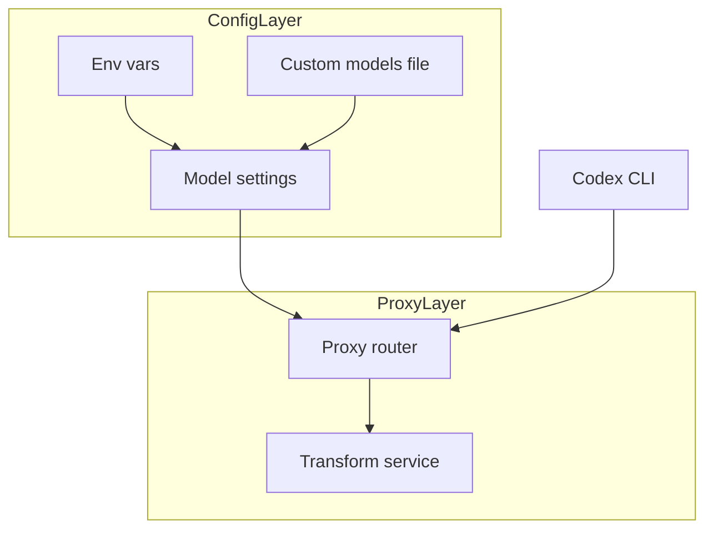
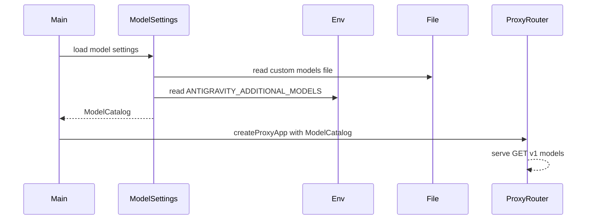

# 技術設計書: codex-cli-model-display

## Overview
**Purpose**: Codex CLI 利用者が再ビルドなしでモデル ID を追加できるよう、`/v1/models` のモデル一覧を設定ベースで拡張する。  
**Users**: Codex CLI を使う開発者が、プロジェクト固有のモデル ID を登録するワークフローで使用する。  
**Impact**: `proxy-router.ts` の固定リスト参照を、起動時にロードしたモデル設定の注入に置き換える。

### Goals
- 環境変数と設定ファイルから追加モデルを読み込み、固定モデルと統合する
- 設定エラー時でも起動と `/v1/models` を継続可能にする
- OpenAI 互換のモデルリスト形式を維持する

### Non-Goals
- 動的なモデル一覧取得（API 不在）
- モデルメタデータ（capabilities、pricing など）の管理
- 設定のホットリロード

## Requirements Traceability

| Requirement | Summary | Components | Interfaces | Flows |
|-------------|---------|------------|------------|-------|
| 1.1 | 環境変数からモデル ID を取得 | ModelSettingsService | load | 起動時ロード |
| 1.2 | 設定ファイルからモデル ID を取得 | ModelSettingsService | load | 起動時ロード |
| 1.3 | 無効設定は警告ログで無視 | ModelSettingsService | load | 起動時ロード |
| 2.1 | 固定 + 追加モデルの統合 | ModelSettingsService | load | 起動時ロード |
| 2.2 | ID ベースの重複排除 | ModelSettingsService | load | 起動時ロード |
| 2.3 | `/v1/models` のレスポンス形式維持 | ProxyRouter | GET v1 models | API 応答 |
| 3.1 | README 更新 | Documentation | - | - |

## Architecture

### Existing Architecture Analysis
- `/v1/models` は `src/proxy/proxy-router.ts` の `FIXED_MODEL_IDS` を直接参照している
- 起動時の DI は `src/main.ts` に集約され、`createProxyApp` に依存を注入している
- `src/config/` 配下に環境変数読み込みの既存パターンがある

### Architecture Pattern & Boundary Map



**Architecture Integration**:
- Selected pattern: 設定モジュール分離 + DI 注入（責務分離とテスト容易性を優先）
- Domain/feature boundaries: Config は設定読み込みと統合、Proxy は HTTP 応答のみ
- Existing patterns preserved: `createProxyApp` を中心とした DI、`config` モジュールの分離
- New components rationale: `ModelSettingsService` で設定読み込みを一元化する
- Composition root: 起動時に `ModelSettingsService` を非同期ロードし、`ModelCatalog` を `createProxyApp` に注入する
- Steering compliance: `structure.md` の DI 方針と `tech.md` の Bun/TypeScript 標準に準拠

## Technology Stack

| Layer | Choice / Version | Role in Feature | Notes |
|-------|------------------|-----------------|-------|
| Backend / Services | Bun >=1.2.19, TypeScript ^5.3, Hono ^4.0, Zod ^3.22 | 設定読み込みと API 応答 | 既存スタックのみ使用 |
| Data / Storage | Local file system | `custom-models.json` 読み込み | 既存 I/O を利用 |

## System Flows



起動時に一度だけ設定を読み込み、`ModelCatalog` を DI で注入する。設定ファイルの探索順は `cwd/custom-models.json` → `.codex/custom-models.json` とし、最初に見つかった 1 件のみを採用する。API リクエストごとのファイル I/O は発生しない。

## Components and Interfaces

| Component | Domain/Layer | Intent | Req Coverage | Key Dependencies (P0/P1) | Contracts |
|-----------|--------------|--------|--------------|--------------------------|-----------|
| ModelSettingsService | Config | モデル設定の読み込みと統合 | 1.1, 1.2, 1.3, 2.1, 2.2 | Bun file (P0), Logger (P1), Zod (P1) | Service |
| ProxyRouter | Proxy | `/v1/models` を提供 | 2.3 | ModelCatalog (P0), TransformService (P0) | API |
| Documentation | Docs | README 更新 | 3.1 | - | - |

### Config Layer

#### ModelSettingsService

| Field | Detail |
|-------|--------|
| Intent | 環境変数と設定ファイルを読み込み、モデル一覧を統合して提供する |
| Requirements | 1.1, 1.2, 1.3, 2.1, 2.2 |

**Responsibilities & Constraints**
- 起動時に一度だけモデル設定を読み込み、結果を返す
- 環境変数は JSON 配列 → カンマ区切りの順に解釈する
- 設定ファイルは `cwd/custom-models.json` → `.codex/custom-models.json` の順で探索する
- 重複は ID ベースで排除し、`env > file > fixed` の優先順位を保つ

**Dependencies**
- Inbound: `startApplication` または `createAppContext` — 起動時ロード (P0)
- External: `Bun.file` — ファイル読み込み (P0)
- External: `Logger` — 警告ログ出力 (P1)
- External: `Zod` — JSON 検証 (P1)

**Contracts**: Service [x] / API [ ] / Event [ ] / Batch [ ] / State [ ]

##### Service Interface
```typescript
type AvailableModel = {
  id: string;
  object: "model";
  created: number;
  owned_by: string;
};

type ModelSourceCounts = {
  fixed: number;
  file: number;
  env: number;
};

type ModelCatalog = {
  models: readonly AvailableModel[];
  sources: ModelSourceCounts;
};

type ModelSettingsOptions = {
  fixedModelIds?: readonly string[];
  customModelPaths?: readonly string[];
  envVar?: string;
  now?: () => number;
  logger?: Logger;
};

interface ModelSettingsService {
  load(options?: ModelSettingsOptions): Promise<ModelCatalog>;
}
```
- Preconditions: なし
- Postconditions:
  - `ModelCatalog.models` は少なくとも固定モデルを含む
  - 無効な設定があっても例外を投げずに完了する
- Invariants:
  - `AvailableModel.id` は一意
  - `AvailableModel.object` は常に "model"

**Implementation Notes**
- Integration: `startApplication`/`createAppContext` を非同期化し、`load` 完了後に `createProxyApp` へ `ModelCatalog` を注入する
- Validation: `custom-models.json` は `models: string[]` のみ許容し、空文字や空白のみの ID は除外する
- Risks: 起動フローの非同期化により初期化順が崩れないようにする

### Proxy Layer

#### ProxyRouter

| Field | Detail |
|-------|--------|
| Intent | OpenAI 互換の `/v1/models` を提供する |
| Requirements | 2.3 |

**Responsibilities & Constraints**
- `ModelCatalog.models` を使用してレスポンスを構築する
- 既存の `/v1/chat/completions` には影響を与えない

**Dependencies**
- Inbound: Codex CLI — HTTP クライアント (P0)
- Inbound: ModelCatalog — 起動時注入 (P0)
- Inbound: TransformService — 既存依存 (P0)

**Contracts**: Service [ ] / API [x] / Event [ ] / Batch [ ] / State [ ]

##### API Contract
| Method | Endpoint | Request | Response | Errors |
|--------|----------|---------|----------|--------|
| GET | /v1/models | - | ModelsListResponse | - |

```typescript
type ModelsListResponse = {
  object: "list";
  data: AvailableModel[];
};
```

**Implementation Notes**
- Integration: `createProxyApp` の引数に `modelCatalog` を追加し、`FIXED_MODEL_IDS` の直接参照を排除する
- Validation: レスポンス形式は既存実装と同一
- Risks: モデルリストが空でも OpenAI 互換形式を維持する

## Data Models

### Domain Model
- `AvailableModel`: モデル識別子と OpenAI 互換属性を保持する
- `ModelCatalog`: 利用可能なモデル一覧と読み込み元の集計を保持する

### Logical Data Model

**Structure Definition**:
| Entity | Attributes | Type | Notes |
|--------|------------|------|-------|
| AvailableModel | id | string | ユニーク ID |
|  | object | "model" | 固定値 |
|  | created | number | Unix 秒 |
|  | owned_by | string | 既定は "antigravity" |
| ModelCatalog | models | AvailableModel[] | 統合済み一覧 |
|  | sources | ModelSourceCounts | 読み込み元の件数 |

**Consistency & Integrity**:
- ID ベースで重複排除し、`env > file > fixed` を優先する
- モデル一覧の順序はマージ順で安定化する

### Data Contracts & Integration

**custom-models.json**
```json
{
  "models": ["custom-model-a", "custom-model-b"]
}
```
探索順: `cwd/custom-models.json` → `.codex/custom-models.json`（先に見つかった 1 件のみ採用）。

**環境変数形式**
```bash
ANTIGRAVITY_ADDITIONAL_MODELS="gemini-1.5-pro-latest,claude-3-5-sonnet"
ANTIGRAVITY_ADDITIONAL_MODELS='["gemini-1.5-pro-latest","claude-3-5-sonnet"]'
```

## Error Handling

### Error Strategy
- 設定読み込みエラーは警告ログのみとし、固定モデルで継続する
- JSON 形式の不整合は例外を捕捉し、該当ソースを無視する

### Error Categories and Responses
- **User Errors**: 設定ミス → 警告ログで通知、起動は継続
- **System Errors**: ファイル読み込み失敗 → 該当ソースをスキップ
- **Business Logic Errors**: 該当なし

### Monitoring
- 起動時に読み込み結果を `sources` 件数でログ出力する

## Testing Strategy

- Unit Tests:
  - 環境変数の JSON 配列/カンマ区切りパース
  - `custom-models.json` の有効/無効ケース
  - マージ順と重複排除（`env > file > fixed`）
- Integration Tests:
  - `/v1/models` が追加モデルを含む
  - 無効設定でも固定モデルのみで応答できる
- E2E Tests:
  - Codex CLI から追加モデルが表示される

## Security Considerations
- 設定ファイル探索は固定パス（`cwd` と `.codex/`）に限定する
- モデル ID は空文字や空白のみを除外し、ログに詳細を出し過ぎない

## Performance & Scalability
- 起動時に一度だけロードし、リクエスト時の I/O を発生させない
- 数十〜数百件のモデル数で十分な性能を維持できる
