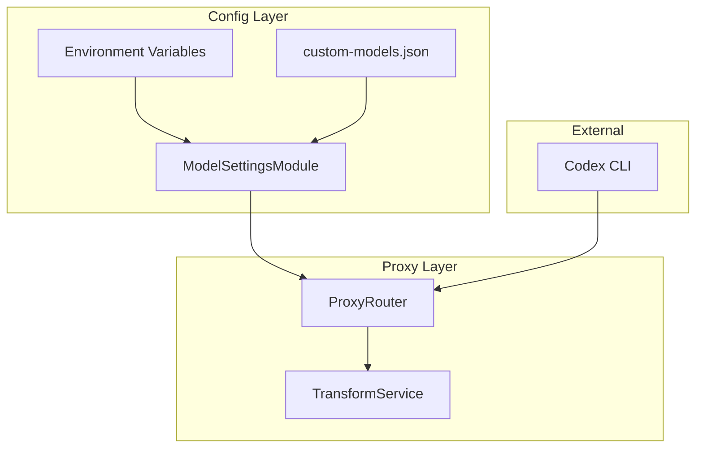
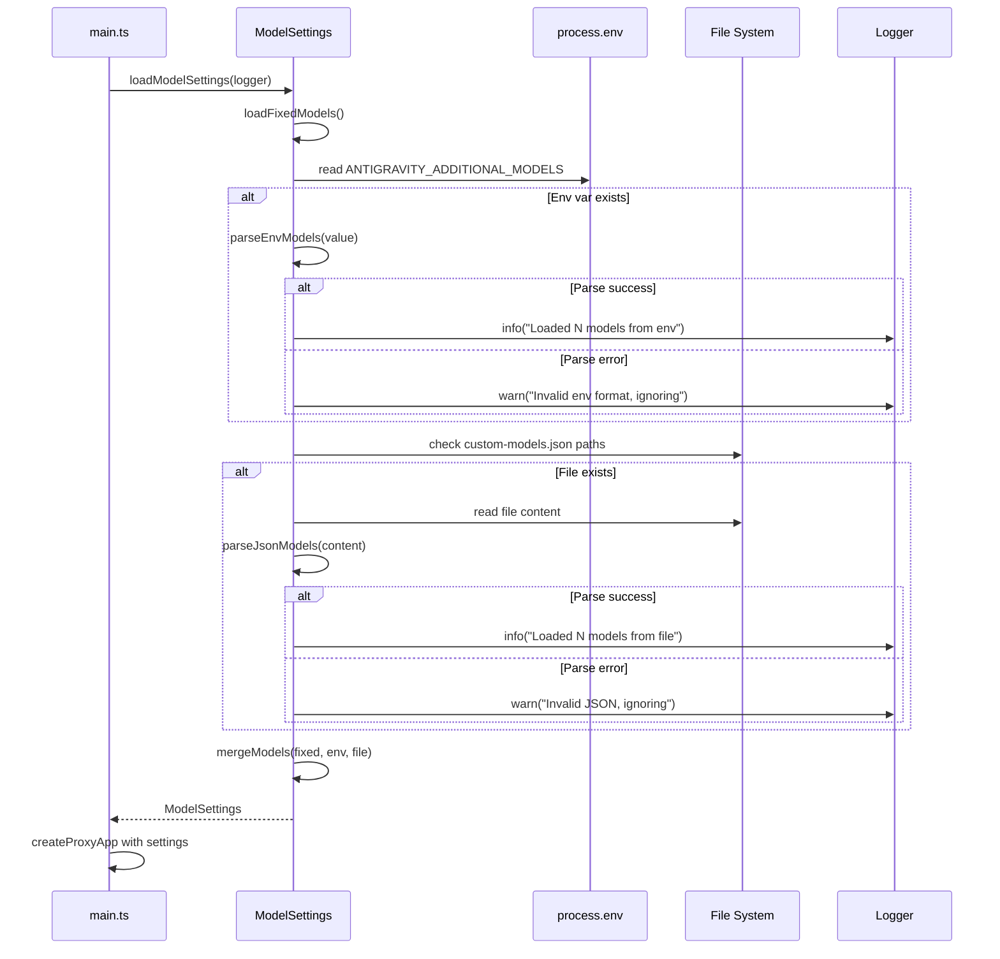
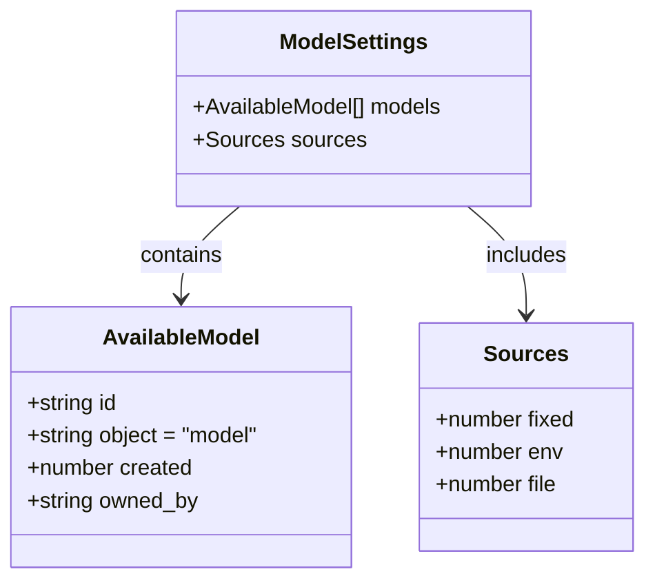

# 技術設計書: Adapter Configurable Model List

## Overview

**Purpose**: この機能は、Codex CLI ユーザーが環境変数や設定ファイルを通じて利用可能なモデルリストをカスタマイズできるようにする。これにより、Google Antigravity API にモデル一覧エンドポイントが存在しない制約を回避し、ユーザー主導で新しいモデルを追加可能にする。

**Users**: Codex CLI を使用する開発者が、プロジェクト固有のモデル（社内限定モデル、新リリースモデル等）を追加するワークフローで活用する。

**Impact**: 現在の `proxy-router.ts` にハードコードされたモデルリストを、設定可能な動的リストに置き換える。既存の固定モデルは引き続きサポートしつつ、追加モデルを統合する。

### Goals
- ユーザーが再ビルドなしで新しいモデル ID を `/v1/models` レスポンスに追加可能にする
- 環境変数（`ANTIGRAVITY_ADDITIONAL_MODELS`）による設定サポート
- オプションの設定ファイル（`custom-models.json`）サポート
- 設定エラー時でもアダプターの起動と動作を継続する（Graceful Degradation）

### Non-Goals
- 動的なモデルリスト取得（API エンドポイントが存在しないため）
- モデルメタデータ（capabilities, pricing 等）の詳細設定
- 設定のホットリロード（初期スコープでは再起動が必要）
- 固定モデルリストの完全な置き換え（マージ方式を採用）

## Architecture

### Existing Architecture Analysis

現在の `/v1/models` エンドポイント実装:
- `src/proxy/proxy-router.ts` 内に `FIXED_MODEL_IDS` 定数として 7 つのモデルがハードコード
- エンドポイントハンドラは直接この定数を参照してレスポンスを構築
- 設定管理ロジックは `src/config/` ディレクトリに配置する既存パターンあり

### Architecture Pattern & Boundary Map



**Architecture Integration**:
- **Selected pattern**: 設定モジュール分離パターン — 設定読み込みロジックをルーターから分離し、単一責任原則を維持
- **Domain/feature boundaries**: 
  - `Config Layer`: 設定の読み込み、パース、マージを担当
  - `Proxy Layer`: HTTP ルーティングとレスポンス構築を担当
- **Existing patterns preserved**: 
  - ファクトリ関数パターン（`createProxyApp`）
  - 環境変数パースパターン（`antigravity.ts` 参照）
  - Logger インターフェース活用
- **New components rationale**: `ModelSettingsModule` を新設し、モデルリスト構築の責務を集約。これにより `proxy-router.ts` の変更を最小化。
- **Steering compliance**: `tech.md` の Bun-First 方針、`structure.md` のサービスモジュールパターンに準拠。

### Technology Stack

| Layer | Choice / Version | Role in Feature | Notes |
|-------|------------------|-----------------|-------|
| Backend / Services | Bun >=1.2.19, TypeScript ^5.3 | 設定読み込み、ファイル I/O | `Bun.file()` API 使用 |
| Validation | Zod ^3.22 | JSON スキーマ検証 | 設定ファイル形式の検証 |
| Logging | Internal Logger | 警告・エラー出力 | 既存 `logging.ts` 活用 |

## System Flows

### 起動時モデル設定読み込みフロー



**Key Decisions**:
- 環境変数が設定ファイルより優先（上書きではなく、両方を統合）
- 重複排除は ID ベースで実施（最後に追加されたものを保持）
- エラー時は警告ログ出力のみで処理継続

## Requirements Traceability

| Requirement | Summary | Components | Interfaces | Flows |
|-------------|---------|------------|------------|-------|
| 1.1 | 環境変数サポート | ModelSettingsModule | loadFromEnv() | 起動時読み込み |
| 1.2 | 設定ファイルサポート | ModelSettingsModule | loadFromFile() | 起動時読み込み |
| 1.3 | バリデーション | ModelSettingsModule | parseModels() | 起動時読み込み |
| 2.1 | マージロジック | ModelSettingsModule | mergeModels() | 起動時読み込み |
| 2.2 | 重複排除 | ModelSettingsModule | deduplicateById() | 起動時読み込み |
| 2.3 | レスポンス形式 | ProxyRouter | GET /v1/models | - |
| 3.1 | ドキュメント更新 | README.md | - | - |

## Components and Interfaces

| Component | Domain/Layer | Intent | Req Coverage | Key Dependencies | Contracts |
|-----------|--------------|--------|--------------|------------------|-----------|
| ModelSettingsModule | Config | モデルリストの読み込み・マージ | 1.1, 1.2, 1.3, 2.1, 2.2 | Logger (P1), Bun.file (P0) | Service |
| ProxyRouter | Proxy | /v1/models エンドポイント提供 | 2.3 | ModelSettingsModule (P0) | API |

### Config Layer

#### ModelSettingsModule

| Field | Detail |
|-------|--------|
| Intent | 環境変数・設定ファイルからモデルリストを読み込み、固定リストとマージして提供 |
| Requirements | 1.1, 1.2, 1.3, 2.1, 2.2 |

**Responsibilities & Constraints**
- 起動時に一度だけモデル設定を読み込み、キャッシュする
- 環境変数（カンマ区切り / JSON 配列）のパース
- 設定ファイル（JSON）の読み込みとパース
- 固定モデルリストとの統合および重複排除
- 無効な設定のスキップと警告ログ出力

**Dependencies**
- Inbound: ProxyRouter — モデルリスト取得に使用 (P0)
- External: Bun.file — ファイル読み込み API (P0)
- External: Logger — ロギング (P1)

**Contracts**: Service [x] / API [ ] / Event [ ] / Batch [ ] / State [ ]

##### Service Interface

```typescript
// src/config/models.ts

/**
 * モデル設定オプション
 */
interface ModelSettingsOptions {
  /** 固定モデル ID リスト */
  fixedModelIds?: readonly string[];
  /** カスタムモデルファイルの探索パス */
  customModelPaths?: readonly string[];
  /** ロガー */
  logger?: Logger;
}

/**
 * 利用可能なモデル情報
 */
interface AvailableModel {
  id: string;
  object: "model";
  created: number;
  owned_by: string;
}

/**
 * モデル設定読み込み結果
 */
interface ModelSettings {
  /** 統合済みモデルリスト */
  models: readonly AvailableModel[];
  /** 読み込んだソース情報（デバッグ用） */
  sources: {
    fixed: number;
    env: number;
    file: number;
  };
}

/**
 * モデル設定を読み込む
 * @param options - オプション設定
 * @returns 統合されたモデル設定
 */
function loadModelSettings(options?: ModelSettingsOptions): Promise<ModelSettings>;

/**
 * 利用可能なモデル ID リストを取得（同期版、キャッシュ使用）
 * @returns モデル ID の配列
 */
function getAvailableModels(): readonly AvailableModel[];

/**
 * デフォルト固定モデル ID リスト
 */
const FIXED_MODEL_IDS: readonly string[];
```

- **Preconditions**: なし（起動時に自動呼び出し）
- **Postconditions**: 
  - 少なくとも固定モデルリストが返る
  - エラー時も固定モデルリストは保証される
- **Invariants**: 
  - モデル ID の重複なし
  - すべてのモデルが `AvailableModel` 形式に準拠

**Implementation Notes**
- **Integration**: `main.ts` の初期化フェーズで `loadModelSettings()` を呼び出し、結果を `createProxyApp` に渡す
- **Validation**: 
  - 環境変数: JSON として解釈失敗時はカンマ区切りでパース
  - ファイル: Zod スキーマで構造検証
- **Risks**: 
  - ファイル読み込み失敗時の起動遅延 → タイムアウト設定で対応可能（将来拡張）

### Proxy Layer

#### ProxyRouter (既存コンポーネント修正)

| Field | Detail |
|-------|--------|
| Intent | OpenAI 互換の `/v1/models` エンドポイントを提供 |
| Requirements | 2.3 |

**Responsibilities & Constraints**
- `/v1/models` GET リクエストに対して OpenAI 形式のモデルリストを返却
- `ModelSettingsModule` から取得したモデルリストを使用

**Dependencies**
- Outbound: ModelSettingsModule — モデルリスト取得 (P0)
- Inbound: Codex CLI — HTTP クライアントとして使用

**Contracts**: Service [ ] / API [x] / Event [ ] / Batch [ ] / State [ ]

##### API Contract

| Method | Endpoint | Request | Response | Errors |
|--------|----------|---------|----------|--------|
| GET | /v1/models | - | ModelsListResponse | - |

```typescript
// Response schema (OpenAI 互換)
interface ModelsListResponse {
  object: "list";
  data: AvailableModel[];
}
```

**Implementation Notes**
- **Integration**: `FIXED_MODEL_IDS` への直接参照を `getAvailableModels()` 呼び出しに置き換え
- **Validation**: レスポンス形式は既存実装を踏襲（変更なし）

## Data Models

### Domain Model



**Business Rules & Invariants**:
- `AvailableModel.id` はユニーク（重複時は後勝ち）
- `AvailableModel.object` は常に `"model"` 固定
- `AvailableModel.owned_by` はデフォルトで `"antigravity"`

### Logical Data Model

**Structure Definition**:

| Entity | Attributes | Type | Notes |
|--------|------------|------|-------|
| AvailableModel | id | string | モデル識別子、PK |
| | object | "model" | 固定値 |
| | created | number | Unix timestamp |
| | owned_by | string | 所有者識別子 |

**Consistency & Integrity**:
- 重複排除は ID ベースの `Map` 構造で実装
- `created` は読み込み時の現在時刻を使用

### Data Contracts & Integration

**設定ファイルスキーマ (custom-models.json)**:

```typescript
// Zod schema
const CustomModelsFileSchema = z.object({
  models: z.array(z.union([
    z.string(), // シンプル形式: "model-id"
    z.object({ // 拡張形式（将来対応）
      id: z.string(),
      owned_by: z.string().optional(),
    }),
  ])),
}).strict();

// 例: custom-models.json
{
  "models": [
    "my-custom-model",
    "another-model",
    { "id": "detailed-model", "owned_by": "my-org" }
  ]
}
```

**環境変数形式**:

```bash
# カンマ区切り形式（推奨）
ANTIGRAVITY_ADDITIONAL_MODELS="gemini-1.5-pro-latest,claude-3-5-sonnet"

# JSON 配列形式
ANTIGRAVITY_ADDITIONAL_MODELS='["gemini-1.5-pro-latest","claude-3-5-sonnet"]'
```

## Error Handling

### Error Strategy

| Error Type | Detection | Response | Recovery |
|------------|-----------|----------|----------|
| 環境変数パースエラー | JSON.parse / split 失敗 | 警告ログ出力 | 環境変数設定を無視、固定リストのみ使用 |
| ファイル未発見 | Bun.file().exists() | デバッグログ（正常） | ファイル設定をスキップ |
| ファイル読み込みエラー | try-catch | 警告ログ出力 | ファイル設定を無視 |
| JSON パースエラー | JSON.parse 失敗 | 警告ログ出力 | ファイル設定を無視 |
| スキーマ検証エラー | Zod parse 失敗 | 警告ログ出力 | ファイル設定を無視 |

### Error Categories and Responses

**System Errors (Configuration)**: 
- すべての設定関連エラーは Graceful Degradation で対応
- コアの固定モデルリストは常に利用可能

**Monitoring**:
- 起動時に読み込み結果をログ出力: `"Model settings loaded: X fixed, Y from env, Z from file"`
- 警告発生時は原因と影響範囲を明示

## Testing Strategy

### Unit Tests
1. `parseEnvModels()`: カンマ区切り・JSON 配列の両形式パース検証
2. `parseJsonFile()`: 有効/無効な JSON ファイルのパース検証
3. `mergeModels()`: 重複排除とマージロジック検証
4. `loadModelSettings()`: 各ソースからの読み込み統合テスト

### Integration Tests
1. `/v1/models` エンドポイント: 環境変数設定時のレスポンス検証
2. `/v1/models` エンドポイント: 設定ファイル存在時のレスポンス検証
3. エラーリカバリ: 無効な設定時でも固定モデルが返ることの検証

### E2E Tests
1. Codex CLI から `/v1/models` を呼び出し、カスタムモデルが表示されることを確認
2. 追加モデルを使用した `/v1/chat/completions` リクエストが受け付けられることを確認

## Security Considerations

- **ファイルパス制限**: 設定ファイルの探索パスは事前定義されたパス（カレントディレクトリ、`.codex/`）に限定。任意のユーザー指定パスは許可しない。
- **入力検証**: すべてのモデル ID は文字列として検証し、長さ制限やフォーマットチェックを実施。
- **ローカルアダプター**: ローカルホストで動作するアダプターであり、ネットワーク経由の攻撃リスクは限定的。

## Performance & Scalability

- **起動時一回読み込み**: 設定は起動時に一度だけ読み込み、メモリにキャッシュ。リクエストごとのファイル I/O は発生しない。
- **想定モデル数**: 数十〜数百のモデル ID を想定。パフォーマンス影響は無視可能。
- **将来拡張**: ホットリロード対応時は、ファイル監視とキャッシュ更新の仕組みを追加。
