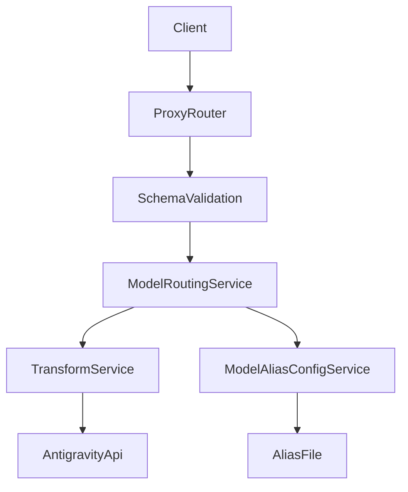
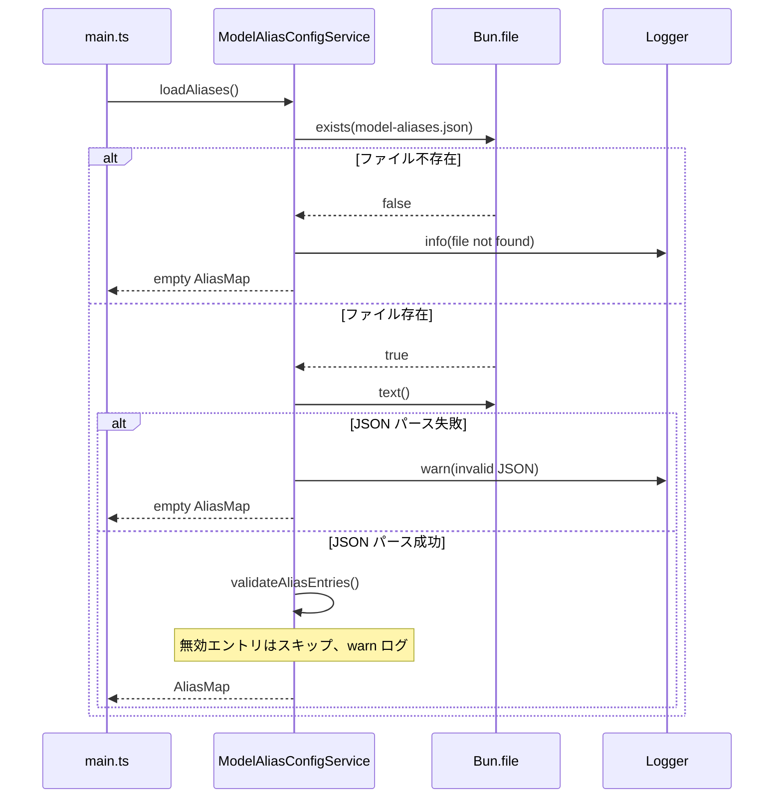
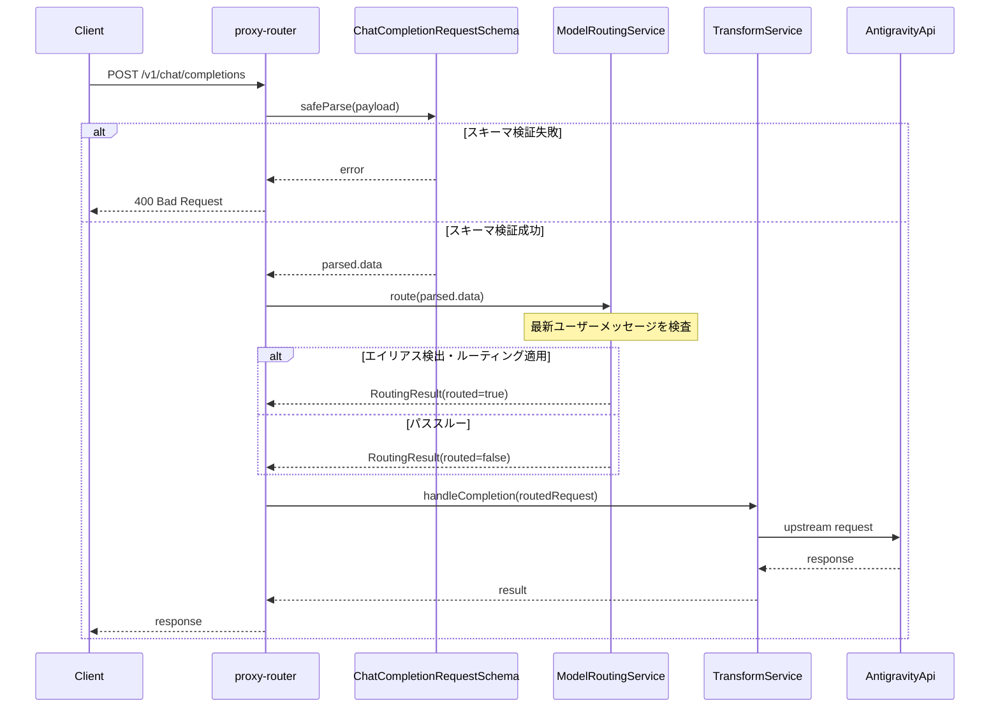

# 設計ドキュメント: dynamic-model-routing

## Overview
本機能は、チャット補完リクエストの最新ユーザーメッセージ先頭に付与されたエイリアスタグ（例: `@fast`）でターゲットモデルを切り替える。対象は既存プロキシの拡張であり、スキーマ検証後の文字列コンテンツに対してルーティングとサニタイズを実行する。既存の変換・認証・通信フローは維持し、ルーティングは独立したサービスとして追加する。

ユーザーは `@fast` のようなタグでモデルを明示でき、管理者は `model-aliases.json` を更新することでクライアント設定の変更なしにルーティングを管理できる。

### Goals
- 先頭エイリアスによるモデル切替とメッセージサニタイズを提供する
- スキーマ検証後の文字列コンテンツに対して安全に適用する
- 既存のプロキシ/変換アーキテクチャを崩さずに統合する

### Non-Goals
- 配列形式や非テキストパートの保持・個別処理
- ターゲットモデルIDの存在検証
- 設定ファイルのホットリロード

## Requirements Traceability

| Requirement | Summary | Components | Interfaces | Flows |
|-------------|---------|------------|------------|-------|
| 1.1 | 起動時にエイリアス設定を読み込む | ModelAliasConfigService | loadAliases | StartupLoad |
| 1.2 | 設定ファイル不存在でも継続 | ModelAliasConfigService | loadAliases | StartupLoad |
| 1.3 | 無効JSONを無視して継続 | ModelAliasConfigService | loadAliases | StartupLoad |
| 1.4 | キーと値をエイリアスとモデルIDとして扱う | ModelAliasConfigService | AliasMap | StartupLoad |
| 2.1 | 最新ユーザーメッセージのみを検査 | ModelRoutingService | route | RoutingSequence |
| 2.2 | ユーザーメッセージ不在はパススルー | ModelRoutingService | route | RoutingSequence |
| 2.3 | 先頭一致かつ空白/終端で検出 | detectAlias | detectAlias | RoutingSequence |
| 2.4 | スキーマ検証後の文字列で検出 | proxy-router, ModelRoutingService | route | RoutingSequence |
| 3.1 | 検出エイリアスでモデルを置換 | ModelRoutingService | route | RoutingSequence |
| 3.2 | 不明エイリアスは元モデル維持 | ModelRoutingService | route | RoutingSequence |
| 3.3 | ルーティング時のデバッグログ | ModelRoutingService | Logger | RoutingSequence |
| 4.1 | エイリアスと直後空白の除去 | detectAlias | detectAlias | RoutingSequence |
| 4.2 | 残りの内容を保持 | detectAlias | detectAlias | RoutingSequence |
| 4.3 | 除去後に空文字でも保持 | ModelRoutingService | route | RoutingSequence |
| 4.4 | 対象メッセージのみ変更 | ModelRoutingService | route | RoutingSequence |
| 5.1 | エイリアス未検出は変更なし | ModelRoutingService | route | RoutingSequence |
| 5.2 | 先頭が `@` でなければ検出スキップ | detectAlias | detectAlias | RoutingSequence |
| 5.3 | model と対象メッセージ以外は不変 | ModelRoutingService | route | RoutingSequence |
| 6.1 | 文字列コンテンツのみ対象 | proxy-router, ModelRoutingService | route | RoutingSequence |
| 6.2 | 配列形式の生データ保持は対象外 | proxy-router | - | RoutingSequence |
| 6.3 | 非テキストパートの個別処理は対象外 | proxy-router | - | RoutingSequence |
| 6.4 | 既存スキーマ変換は変更しない | proxy-router | - | RoutingSequence |

## Architecture

### Existing Architecture Analysis
- `proxy-router.ts` が `/v1/chat/completions` の入口として `ChatCompletionRequestSchema.safeParse` を実行する
- `UserContentSchema` がユーザーコンテンツを文字列に変換しているため、ルーティング対象は検証後の文字列となる
- `transform-service.ts` は検証済みリクエストを Antigravity へ変換するため、ルーティングはその前段に配置する
- 既存の `model-settings-service.ts` には `isUnsafePath`、`realpath` によるパス検証パターンが実装済み

### Architecture Pattern & Boundary Map



#### Middleware と Service の関係
- 要件における「Dynamic Model Routing Middleware」は**論理的なルーティング段階**を指す
- 実装では既存の Service Modules パターンに従い `ModelRoutingService` として提供する
- `proxy-router.ts` のルートハンドラ内で、スキーマ検証後・`transformService.handleCompletion` 呼び出し前に `modelRoutingService.route()` を明示的に呼び出す
- これにより Hono ミドルウェアチェーンへの新規追加なしに、処理順序を制御可能とする

#### Architecture Integration
- Selected pattern: プロキシハンドラ内でのサービス呼び出し（Hono middleware ではなく明示的呼び出し）
- Domain/feature boundaries: 設定読み込みは Config 層、ルーティングは Proxy 層、検出は純粋関数として Utility 層に分離
- Existing patterns preserved: Factory 関数の DI、スキーマ検証後の変換パイプライン
- New components rationale: 設定読み込みとルーティングの責務分離でテスト容易性を確保
- Steering compliance: 既存の `createService` パターン、Zod 変換維持、Bun/Hono 依存の維持

### Technology Stack & Alignment

| Layer | Choice / Version | Role in Feature | Notes |
|-------|------------------|-----------------|-------|
| Backend / Services | TypeScript ^5.3 | ルーティングと設定読み込み | 型安全を厳格に適用 |
| Runtime | Bun >=1.2.19 | ファイル読み込みとサーバ実行 | `Bun.file` を利用 |
| Web Framework | Hono ^4.0 | 既存ルータ統合 | 新規エンドポイント/ミドルウェア追加なし |
| Validation | Zod ^3.22 | 既存スキーマ変換を維持、設定ファイル検証に追加利用 | エイリアス設定用スキーマを定義 |
| Testing | bun:test | ルーティングの単体/統合テスト | 既存運用に準拠 |

## System Flows

### Startup Flow: エイリアス設定読み込み



### Request Flow: ルーティング処理



- ルーティングは `ChatCompletionRequestSchema` 検証後のリクエストにのみ適用する
- エイリアス検出は最新ユーザーメッセージのみに限定する
- ルーティング処理で例外が発生した場合はパススルーで継続する

## Components & Interface Contracts

| Component | Domain/Layer | Intent | Req Coverage | Key Dependencies (P0/P1) | Contracts |
|-----------|--------------|--------|--------------|--------------------------|-----------:|
| ModelAliasConfigService | Config | エイリアス設定の読み込みと参照 | 1.1, 1.2, 1.3, 1.4 | Logger (P1), Bun file (P1) | Service |
| ModelRoutingService | Proxy | ルーティング決定とサニタイズ | 2.1, 2.2, 3.1, 3.2, 3.3, 4.1, 4.2, 4.3, 4.4, 5.1, 5.3 | ModelAliasConfigService (P0), Logger (P1) | Service |
| detectAlias | Utility | 先頭エイリアス検出（純粋関数） | 2.3, 4.1, 4.2, 5.2 | - | Function |
| proxy-router Integration | Proxy | ルーティング呼び出し位置の調整 | 2.4, 6.1, 6.2, 6.3, 6.4 | ModelRoutingService (P0) | - |

### Config Layer

#### ModelAliasConfigService

| Field | Detail |
|-------|--------|
| Intent | エイリアスマッピングの読み込みと参照を提供する |
| Requirements | 1.1, 1.2, 1.3, 1.4 |

##### Responsibilities & Constraints
- 起動時に `model-aliases.json` を読み込み、`ReadonlyMap<string, string>` として保持する
- ファイル不存在時は info ログを出力し、空マップで継続する
- JSON パース失敗時は warn ログを出力し、空マップで継続する
- 各エントリを Zod スキーマで検証し、無効エントリはスキップして warn ログを出力する
- 設定ファイルパスはプロジェクトルート直下の `model-aliases.json` に固定する
- `isUnsafePath` と `realpath` によるシンボリックリンク対策を適用する（既存 `model-settings-service.ts` のパターンを踏襲）

##### Dependencies
- Inbound: ModelRoutingService — ルーティング時の参照 (P0)
- Outbound: Logger — ログ出力 (P1)
- External: Bun file — ファイル読み込み (P1)

##### Contracts: Service [x] / API [ ] / Event [ ] / Batch [ ] / State [ ]

##### Service Interface
```typescript
/** エイリアスタグからターゲットモデルIDへのマッピング */
type AliasMap = ReadonlyMap<string, string>;

/** エイリアス設定サービスのインターフェース */
interface ModelAliasConfigService {
  /** 指定エイリアスに対応するターゲットモデルIDを取得する */
  getTargetModel(alias: string): string | undefined;
  /** 指定エイリアスが設定に存在するか判定する */
  hasAlias(alias: string): boolean;
  /** 設定済みエイリアスの一覧を取得する */
  listAliases(): readonly string[];
  /** 全エイリアスマップを取得する */
  getAll(): AliasMap;
}

/** エイリアス設定の読み込みオプション */
interface LoadAliasesOptions {
  /** 設定ファイルパス（デフォルト: model-aliases.json） */
  filePath?: string;
  /** ロガー */
  logger?: Logger;
  /** テスト用: パス安全性チェックをスキップ */
  skipPathSafetyCheck?: boolean;
}

/** エイリアス設定サービスのファクトリ関数 */
function createModelAliasConfigService(): {
  loadAliases(options?: LoadAliasesOptions): Promise<ModelAliasConfigService>;
};
```
- Preconditions:
  - `alias` は `@` で始まる文字列を想定する
- Postconditions:
  - 未定義の場合は `undefined` を返す
  - 読み込みエラー時も例外を投げず、空マップを返す
- Invariants:
  - 内部マップは読み込み後に不変

##### Configuration File Schema
```typescript
/** model-aliases.json の検証スキーマ */
const AliasEntrySchema = z.object({}).catchall(z.string());

/** エイリアスタグの形式検証 */
const AliasTagSchema = z.string().regex(/^@[a-zA-Z][a-zA-Z0-9_-]*$/);

/** model-aliases.json の期待形式 */
// {
//   "@fast": "gemini-3-flash",
//   "@think": "claude-sonnet-4-5-thinking"
// }
```

##### Implementation Notes
- Integration: `main.ts` の `startApplication` で非同期にロードし `createAppContext` に注入する
- Validation: 
  - `isUnsafePath` で `..` や絶対パスを拒否
  - `realpath` でシンボリックリンクを解決し、プロジェクトルート内に収まることを検証
  - 各エントリのキー・値を `AliasTagSchema` / `z.string().min(1)` で検証
- Risks: 設定変更は再起動が必要

### Utility Layer

#### detectAlias (Pure Function)

| Field | Detail |
|-------|--------|
| Intent | 先頭エイリアスの検出と残りテキストの抽出 |
| Requirements | 2.3, 4.1, 4.2, 5.2 |

##### Responsibilities & Constraints
- コンテンツ先頭が `@` で始まらない場合は即時非検出とする
- 既知エイリアスに完全一致し、直後が空白または終端の場合のみ検出する
- 非検出時は入力文字列を変更しない（参照を維持）

##### Dependencies
- Inbound: ModelRoutingService — ルーティング判定 (P0)
- Outbound: -
- External: -

##### Contracts: Service [ ] / API [ ] / Event [ ] / Batch [ ] / State [ ]

##### Function Interface
```typescript
/** エイリアス検出結果 */
interface AliasDetectionResult {
  /** 検出されたエイリアス（非検出時は null） */
  alias: string | null;
  /** エイリアス除去後の残りコンテンツ */
  remainingContent: string;
}

/**
 * コンテンツ先頭からエイリアスを検出し、残りテキストを抽出する
 * @param content スキーマ検証後の文字列コンテンツ
 * @param knownAliases 設定済みエイリアスの集合
 * @returns 検出結果
 */
function detectAlias(
  content: string,
  knownAliases: ReadonlySet<string>
): AliasDetectionResult;
```
- Preconditions:
  - `content` はスキーマ検証後の文字列
- Postconditions:
  - `alias === null` の場合、`remainingContent === content`（同一参照）
  - `alias !== null` の場合、`remainingContent` はエイリアスと直後の空白（1文字）を除去した文字列
- Invariants:
  - 純粋関数として副作用なし

##### Implementation Notes
- Integration: `ModelRoutingService` が `knownAliases` を渡して利用する
- Validation: 空白/終端条件を必須化する
- Risks: エイリアスが意図しない先頭一致の場合は非検出

### Proxy Layer

#### ModelRoutingService

| Field | Detail |
|-------|--------|
| Intent | ルーティング決定、モデル切替、サニタイズを実行する |
| Requirements | 2.1, 2.2, 3.1, 3.2, 3.3, 4.1, 4.2, 4.3, 4.4, 5.1, 5.3 |

##### Responsibilities & Constraints
- 最新ユーザーメッセージのみを対象にエイリアス検出を行う
- 検出されたエイリアスが未定義の場合は変更なしで返す
- ルーティング適用時は必ず `debug` ログを出力する
- `model` と対象メッセージ以外は変更しない
- ルーティング処理中の例外はキャッチし、パススルーで継続する

##### Dependencies
- Inbound: proxy-router — リクエスト処理 (P0)
- Outbound: ModelAliasConfigService — エイリアス解決 (P0)
- Outbound: Logger — ルーティングログ (P1)
- External: -

##### Contracts: Service [x] / API [ ] / Event [ ] / Batch [ ] / State [ ]

##### Service Interface
```typescript
/** ルーティング結果 */
interface RoutingResult {
  /** ルーティング後のリクエスト */
  request: ChatCompletionRequest;
  /** ルーティングが適用されたか */
  routed: boolean;
  /** 検出されたエイリアス（適用時のみ） */
  detectedAlias?: string;
  /** 元のモデルID（適用時のみ） */
  originalModel?: string;
}

/** モデルルーティングサービスのインターフェース */
interface ModelRoutingService {
  /**
   * リクエストにルーティングを適用する
   * @param request スキーマ検証済みリクエスト
   * @returns ルーティング結果
   */
  route(request: ChatCompletionRequest): RoutingResult;
}

/** ルーティングサービスのオプション */
interface CreateModelRoutingServiceOptions {
  aliasConfig: ModelAliasConfigService;
  logger?: Logger;
}

/** ルーティングサービスのファクトリ関数 */
function createModelRoutingService(
  options: CreateModelRoutingServiceOptions
): ModelRoutingService;
```
- Preconditions:
  - `request` は `ChatCompletionRequestSchema` 検証済み
- Postconditions:
  - `routed === false` の場合、`request` は入力と同一参照でもよい
  - `routed === true` の場合、`model` と対象メッセージのみ変更される
- Invariants:
  - ユーザーメッセージが存在しない場合は無変更

##### Implementation Notes
- Integration: `createProxyApp` に `modelRoutingService` を注入し、スキーマ検証後・`handleCompletion` 前に `route` を呼び出す
- Validation: `findLastUserMessageIndex` により末尾から探索する
- Risks: 既知エイリアスの更新は再起動が必要

#### proxy-router Integration

| Field | Detail |
|-------|--------|
| Intent | ルーティング適用位置を固定し、スキーマ変換を保護する |
| Requirements | 2.4, 6.1, 6.2, 6.3, 6.4 |

##### Responsibilities & Constraints
- `ChatCompletionRequestSchema.safeParse` 後、`transformService.handleCompletion` 前にルーティングを適用する
- スキーマ変換ロジックは変更しない
- ルーティングサービスは `CreateProxyAppOptions` 経由で注入する

##### Integration Point (proxy-router.ts 変更箇所)
```typescript
// 現在の実装（L52-68）
const parsed = ChatCompletionRequestSchema.safeParse(payload);
if (!parsed.success) {
  return c.json({ error: { ... } }, 400);
}

// ★ ここにルーティング処理を挿入
const routingResult = options.modelRoutingService?.route(parsed.data);
const routedRequest = routingResult?.request ?? parsed.data;

const result = normalizeTransformResult(
  await options.transformService.handleCompletion(routedRequest) // ← 変更
);
```

##### Implementation Notes
- Integration: `CreateProxyAppOptions` に `modelRoutingService?: ModelRoutingService` を追加
- Validation: ルーティング有無に関わらず `transformService` の契約を維持する
- Risks: ルーティング追加によるレスポンス遅延は軽微（Map 参照のみ）

## Data Models

### Domain Model
- エイリアスは `@` で始まるタグとして扱う（`@[a-zA-Z][a-zA-Z0-9_-]*`）
- エイリアスはターゲットモデルIDに1対1で対応する
- 同一エイリアスに複数のモデルIDを設定することは不可

### Logical Data Model

**Structure Definition**:
- `model-aliases.json` はキーがエイリアスタグ、値がターゲットモデルIDのフラットなJSONオブジェクト
- エイリアス形式: `@[a-zA-Z][a-zA-Z0-9_-]*`
- モデルID形式: 空でない文字列

**Sample Configuration**:
```json
{
  "@fast": "gemini-3-flash",
  "@think": "claude-sonnet-4-5-thinking",
  "@pro": "gemini-3-pro-high"
}
```

**Consistency & Integrity**:
- 読み込み時に無効なエントリは除外し、残りを保持する
- 重複キーは JSON パーサーの標準動作（後勝ち）に従う

### Data Contracts & Integration

#### API Data Transfer
- 既存の OpenAI 互換リクエストに変更はない
- 変換前後で `model` と対象ユーザーメッセージ以外は不変

## Error Handling

### Error Strategy
- **フェイルオープン**: ルーティング関連のエラーはパススルーで継続する
- 検証失敗はログで観測可能にし、リクエスト拒否は行わない
- 設定読み込み失敗時もサービス起動を継続する

### Error Categories and Responses

| Category | Condition | Log Level | Behavior |
|----------|-----------|-----------|----------|
| ファイル不存在 | `model-aliases.json` が存在しない | info | 空マップで継続 |
| JSON パース失敗 | ファイル内容が無効な JSON | warn | 空マップで継続 |
| スキーマ不一致 | JSON がオブジェクト形式でない | warn | 空マップで継続 |
| 無効エントリ | キーが `@` で始まらない、値が空文字列 | warn | 該当エントリを除外、残りを使用 |
| パス安全性違反 | `..` を含む、絶対パス、cwd 外のシンボリックリンク | warn | ファイルを無視、空マップで継続 |
| ルーティング処理例外 | route() 内で予期しない例外 | error | パススルー（無変更）で継続 |

### Monitoring
- ルーティング適用時は `debug` ログで以下を記録する:
  - `originalModel`: 元のモデルID
  - `alias`: 検出されたエイリアス
  - `targetModel`: ルーティング先のモデルID

## Testing Strategy

### Unit Tests
- `detectAlias`:
  - 先頭が `@` でない場合は非検出
  - 既知エイリアスに完全一致かつ直後が空白の場合は検出
  - 既知エイリアスに完全一致かつ直後が終端の場合は検出
  - 部分一致（`@fast` に対して `@faster`）は非検出
  - 未知エイリアス（`@unknown`）は非検出
  - エイリアス除去後の残りコンテンツが正しいこと
- `ModelAliasConfigService`:
  - 正常な設定ファイルの読み込み
  - ファイル不存在時に空マップを返すこと
  - 無効 JSON 時に空マップを返すこと
  - 無効エントリのスキップと警告ログ
  - パス安全性チェック（`..`、絶対パス、シンボリックリンク）
- `ModelRoutingService`:
  - エイリアス検出時のモデル置換
  - 未知エイリアス時のパススルー
  - ユーザーメッセージ不在時のパススルー
  - 最後のユーザーメッセージのみ変更されること
  - 例外発生時のパススルー

### Integration Tests
- `proxy-router` でのルーティング適用位置検証
  - スキーマ検証後にルーティングが呼ばれること
  - ルーティング後に `transformService` が呼ばれること
- 既存の `transformService` との連携
  - ルーティング有無に関わらず正常にレスポンスが返ること
- エイリアス設定の依存注入
  - `ModelAliasConfigService` が `createAppContext` から注入されること

### Property Tests
- エイリアス検出とサニタイズの不変条件
  - 非検出時は `remainingContent === content`（同一参照）
  - 検出時は `content.startsWith(alias)`
- 最後のユーザーメッセージのみ変更されること
  - `messages` 配列の他の要素は変更されないこと
- `model` 以外のリクエストフィールドは不変

## Security Considerations

### パストラバーサル防止
- 設定ファイルパスはプロジェクトルート直下の `model-aliases.json` に固定する
- `isUnsafePath` により以下を拒否:
  - `..` を含むパス
  - 絶対パス（`/` で始まる、`C:\` 形式）
- `realpath` によりシンボリックリンクを解決し、プロジェクトルート内に収まることを検証する
- 既存の `model-settings-service.ts` と同一のパターンを適用する

### 入力検証
- エイリアスタグ形式を Zod で検証（`@[a-zA-Z][a-zA-Z0-9_-]*`）
- モデルIDは空でない文字列であることを検証
- 無効設定時はパススルーとし、外部サービスへの影響を最小化する

## Performance & Scalability

- メッセージ配列の末尾からの走査は O(n) だが n は小さく許容範囲
- エイリアス解決は `Map.get` で O(1) を維持する
- 設定ファイルは起動時に一度だけ読み込み、メモリ上に保持する
- ルーティング処理は同期的であり、レイテンシへの影響は最小限
