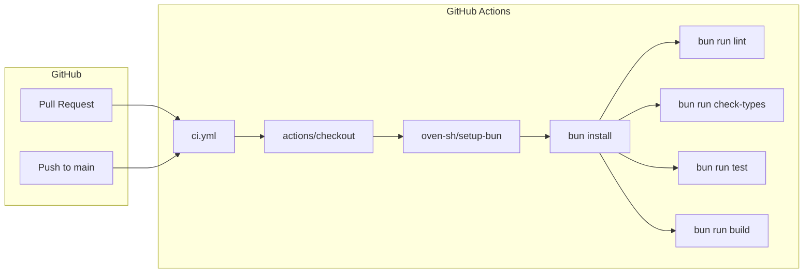
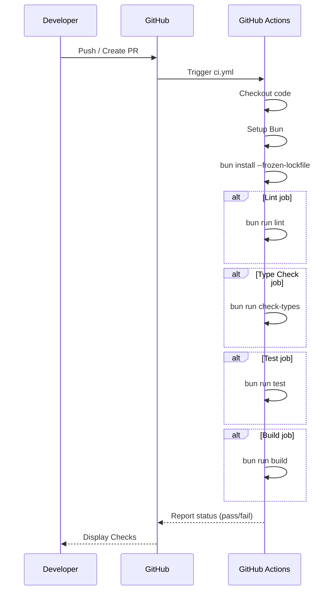

# Design: github-actions-ci-pipelines

## Overview

**Purpose**: Pull Request 作成時および `main` ブランチへの Push 時に、ユニットテスト・ビルド・型チェック・Lint を自動実行する GitHub Actions CI パイプラインを構築する。

**Users**: リポジトリ開発者・コントリビュータは、コード変更時に品質チェックの自動フィードバックを受け取る。

**Impact**: 現在 CI 未導入の状態から、自動化された品質ゲートを持つ開発フローへ移行する。

### Goals
- PR および main Push をトリガーに CI を自動起動
- ユニットテスト、ビルド、型チェック、Lint を一貫して実行
- 失敗時は明確なフィードバックを GitHub Checks で表示
- 同一 PR の重複実行を抑制し、フィードバック待ち時間を短縮
- 最小権限で安全に動作

### Non-Goals
- デプロイ・リリースパイプライン（本設計スコープ外）
- E2E テスト（将来拡張として検討）
- Codecov 等カバレッジレポート連携（将来拡張）

## Architecture

### Architecture Pattern & Boundary Map

**Architecture Integration**:
- **Selected pattern**: 単一ワークフロー・複数ジョブ構成
- **Domain/feature boundaries**: CI 設定は `.github/workflows/` に集約、ソースコードには影響なし
- **Existing patterns preserved**: Bun スクリプト (`bun run ...`) を活用
- **New components rationale**: Biome を devDependency に追加（Lint 実行のため）
- **Steering compliance**: `tech.md` の Bun-First 方針に沿った高速ツール選択

### Technology Stack

| Layer | Choice / Version | Role in Feature | Notes |
|-------|------------------|-----------------|-------|
| CI Platform | GitHub Actions | ワークフロー実行基盤 | 無料枠で十分 |
| Runtime Setup | oven-sh/setup-bun@v2 | Bun 環境構築 | package.json の engines.bun を参照 |
| Checkout | actions/checkout@v4 | リポジトリ取得 | 標準 Action |
| Test Runner | bun test | ユニットテスト | 既存スクリプト |
| Build | bun build | ビルド | 既存スクリプト |
| Type Check | tsc --noEmit | 型チェック | 新規スクリプト追加 |
| Linter | @biomejs/biome@latest | Lint + Format | 新規導入 |

## System Flows

### CI 実行フロー

**Key Decisions**:
- Lint / TypeCheck / Test / Build は並列ジョブとして実行可能（依存関係なし）
- 各ジョブ失敗時はワークフロー全体が失敗ステータスになる

## Requirements Traceability

| Requirement | Summary | Components | Interfaces | Flows |
|-------------|---------|------------|------------|-------|
| 1.1 | PR 作成・更新時に CI 起動 | ci.yml `on.pull_request` | — | CI 実行フロー |
| 1.2 | main Push 時に CI 起動 | ci.yml `on.push` | — | CI 実行フロー |
| 1.3 | コミット SHA・イベント識別 | ci.yml ログ出力 | — | — |
| 2.1 | ユニットテスト実行 | Test job, `bun run test` | — | CI 実行フロー |
| 2.2 | ビルド実行 | Build job, `bun run build` | — | CI 実行フロー |
| 2.3 | 型チェック実行 | TypeCheck job, `bun run check-types` | — | CI 実行フロー |
| 2.4 | Lint 実行 | Lint job, `bun run lint` | — | CI 実行フロー |
| 2.5 | チェック失敗時に失敗終了 | 各ジョブの exit code | — | — |
| 3.1 | Bun 実行環境 | oven-sh/setup-bun@v2 | — | CI 実行フロー |
| 3.2 | lockfile 基準の依存解決 | `bun install --frozen-lockfile` | — | CI 実行フロー |
| 3.3 | 依存解決失敗時のログ報告 | bun install ログ | — | — |
| 4.1 | Checks で成否識別 | GitHub Actions Checks API | — | — |
| 4.2 | 失敗箇所の可視化 | ジョブログ | — | — |
| 4.3 | 成功の明示 | Checks ステータス | — | — |
| 5.1 | 旧コミット実行キャンセル | ci.yml `concurrency.cancel-in-progress` | — | — |
| 5.2 | 同時実行を 1 件に制限 | ci.yml `concurrency.group` | — | — |
| 6.1 | 最小権限 | ci.yml `permissions: contents: read` | — | — |
| 6.2 | 機密情報非露出 | シークレット不使用 | — | — |
| 6.3 | 外部 PR でも実行可能 | pull_request イベント特性 | — | — |

## Components and Interfaces

| Component | Domain/Layer | Intent | Req Coverage | Key Dependencies | Contracts |
|-----------|--------------|--------|--------------|------------------|-----------|
| ci.yml | CI/CD | GitHub Actions ワークフロー定義 | 1.1-1.3, 4.1-4.3, 5.1-5.2, 6.1-6.3 | actions/checkout, oven-sh/setup-bun | — |
| Lint Job | CI/CD | Biome による Lint 実行 | 2.4, 2.5 | biome | — |
| TypeCheck Job | CI/CD | TypeScript 型チェック | 2.3, 2.5 | tsc | — |
| Test Job | CI/CD | ユニットテスト実行 | 2.1, 2.5 | bun test | — |
| Build Job | CI/CD | ビルド実行 | 2.2, 2.5 | bun build | — |
| biome.json | Config | Biome 設定 | 2.4 | — | — |
| package.json scripts | Config | npm スクリプト追加 | 2.3, 2.4 | — | — |

### CI/CD Layer

#### ci.yml

| Field | Detail |
|-------|--------|
| Intent | GitHub Actions ワークフローを定義し、品質チェックを自動化 |
| Requirements | 1.1, 1.2, 1.3, 4.1, 4.2, 4.3, 5.1, 5.2, 6.1, 6.2, 6.3 |

**Responsibilities & Constraints**
- PR および main Push をトリガーに CI を起動
- 4 つのジョブ（lint, type-check, test, build）を並列実行
- `concurrency` で重複実行を抑制
- `permissions: contents: read` で読み取り専用

**Dependencies**
- External: `actions/checkout@v4` — リポジトリ取得 (P0)
- External: `oven-sh/setup-bun@v2` — Bun セットアップ (P0)

**Contracts**: —

**Implementation Notes**
- `bun-version-file: "package.json"` で engines.bun を参照
- `bun install --frozen-lockfile` で再現性を保証

#### Lint Job

| Field | Detail |
|-------|--------|
| Intent | Biome を使用してコードの静的解析を実行 |
| Requirements | 2.4, 2.5 |

**Responsibilities & Constraints**
- `bun run lint` を実行
- 違反があれば非ゼロ終了でジョブ失敗

**Dependencies**
- External: `@biomejs/biome` — Linter (P0)

#### TypeCheck Job

| Field | Detail |
|-------|--------|
| Intent | TypeScript コンパイラで型エラーを検出 |
| Requirements | 2.3, 2.5 |

**Responsibilities & Constraints**
- `bun run check-types` を実行
- 型エラーがあれば非ゼロ終了

**Dependencies**
- External: `typescript` — Compiler (P0)

#### Test Job

| Field | Detail |
|-------|--------|
| Intent | ユニットテストを実行 |
| Requirements | 2.1, 2.5 |

**Responsibilities & Constraints**
- `bun run test` を実行
- テスト失敗時は非ゼロ終了

**Dependencies**
- Internal: `bun:test` — Test Runner (P0)

#### Build Job

| Field | Detail |
|-------|--------|
| Intent | プロダクションビルドを実行 |
| Requirements | 2.2, 2.5 |

**Responsibilities & Constraints**
- `bun run build` を実行
- ビルドエラー時は非ゼロ終了

**Dependencies**
- Internal: `bun build` — Bundler (P0)

### Config Layer

#### biome.json

| Field | Detail |
|-------|--------|
| Intent | Biome のルール設定 |
| Requirements | 2.4 |

**Responsibilities & Constraints**
- `src/` および `tests/` を対象
- TypeScript プロジェクト向けルールを適用
- `formatter.enabled: true`, `linter.enabled: true`

#### package.json scripts

| Field | Detail |
|-------|--------|
| Intent | npm スクリプトを追加 |
| Requirements | 2.3, 2.4 |

**New Scripts**:
- `"lint": "biome check src tests"`
- `"check-types": "tsc --noEmit"`

## Error Handling

### Error Strategy
各ジョブは非ゼロ終了コードでエラーを報告。GitHub Actions が失敗ステータスを Checks に反映。

### Error Categories and Responses
- **Lint Errors**: Biome がエラーを出力、ジョブ失敗
- **Type Errors**: tsc がエラーを出力、ジョブ失敗
- **Test Failures**: bun test がエラーを出力、ジョブ失敗
- **Build Errors**: bun build がエラーを出力、ジョブ失敗
- **Dependency Resolution Errors**: `bun install --frozen-lockfile` 失敗時、ログに原因出力

### Monitoring
- GitHub Actions UI でジョブログを確認
- GitHub Checks API で成否を PR に表示

## Testing Strategy

### CI ワークフローテスト
- **手動検証**: ワークフロー追加後、テスト PR を作成して動作確認
- **Lint 通過確認**: 既存コードが Biome ルールに適合することを確認
- **型チェック通過確認**: `bun run check-types` がエラーなしで通過
- **テスト通過確認**: 既存テストが全て通過
- **ビルド通過確認**: `bun run build` が成功

### 失敗シナリオテスト
- 意図的に Lint エラーを含むコミットで PR を作成し、失敗表示を確認
- 意図的に型エラーを含むコミットで失敗を確認

## Security Considerations

- **最小権限**: `permissions: contents: read` のみ
- **シークレット不使用**: CI はシークレットを必要としない
- **外部 Action のピン留め**: `@v4`, `@v2` など明示的バージョン指定
- **Fork PR の安全性**: `pull_request` イベントは書き込み権限を持たない

---

**Initialized**: 2025-12-29T01:01:11+09:00
