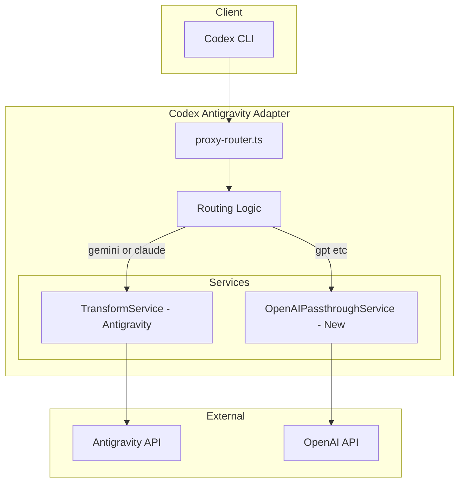
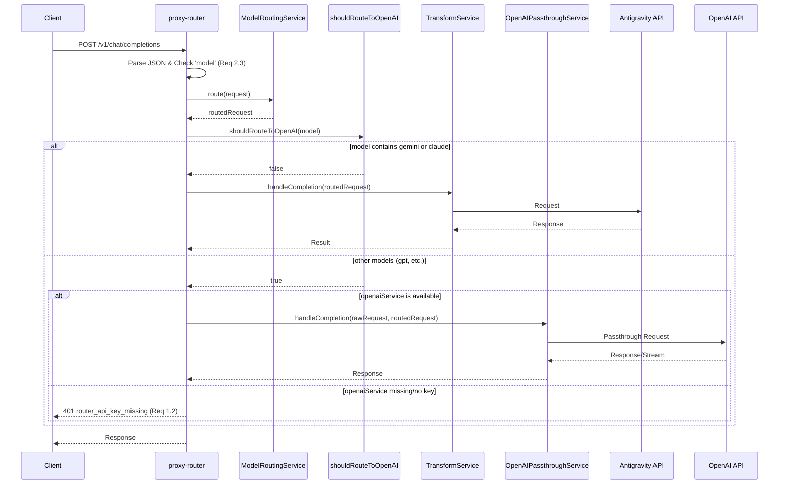
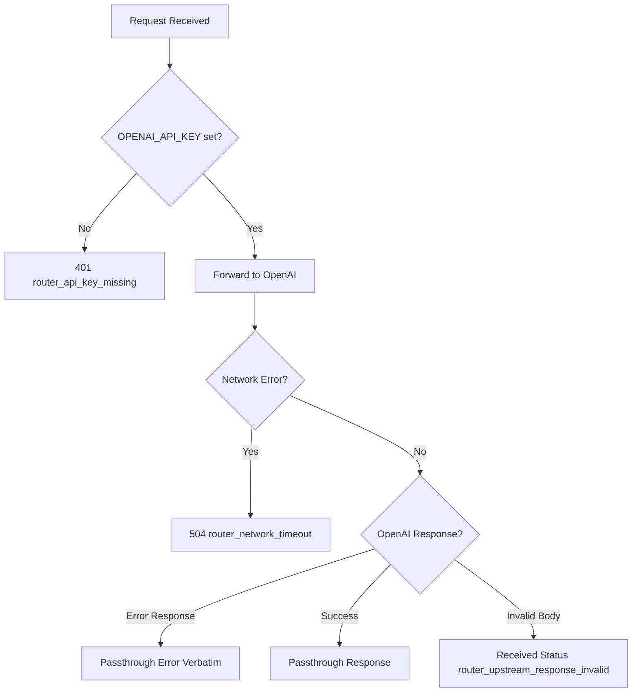

# 技術設計書: OpenAI Passthrough

## Overview

**Purpose**: OpenAI Passthrough ルーターは、OpenAI 互換クライアントからのリクエストを `model` 名に基づいて Antigravity または OpenAI API に自動で振り分ける機能を提供する。これにより、クライアントは単一のエンドポイント設定で複数のプロバイダーのモデルをシームレスに利用できるようになる。

**Users**: Codex CLI ユーザーおよび OpenAI 互換クライアントを使用する開発者が、設定変更なしで Gemini/Claude（Antigravity経由）と GPT（OpenAI直接）の両方を利用できる。

**Impact**: 既存の `/v1/chat/completions` エンドポイントに分岐ロジックを追加し、新しい `OpenAIPassthroughService` を導入する。既存の Antigravity 変換フローへの影響は最小限。

### Goals
- `model` 名に基づく自動ルーティング（gemini/claude → Antigravity、その他 → OpenAI）
- OpenAI API へのリクエスト/レスポンスの透過的なパススルー（スキーマ変換なし）
- サーバー側 `OPENAI_API_KEY` による認証管理（クライアント設定不要）
- OpenAI 互換エラーレスポンスの一貫した提供

### Non-Goals
- `/v1/models` エンドポイントへの OpenAI モデル追加（フォローアップタスク）
- OpenAI API からの動的モデル取得
- 複数の OpenAI API キーのサポート

## Architecture

> 詳細なディスカバリー結果は `research.md` を参照。本設計書は自己完結したレビューアーティファクトとして必要な判断と契約を記載する。

### Existing Architecture Analysis

現在のアーキテクチャは以下のパターンに従っている:

- **DI パターン**: ファクトリー関数 (`createProxyApp`, `createTransformService`) で依存性注入
- **責務分離**: Router（ルーティング）、Service（ビジネスロジック）、Transformer（変換）
- **Result 型**: `{ ok: true, value: T } | { ok: false, error: E }` による明示的エラーハンドリング

**Integration Points**:
- `proxy-router.ts`: リクエスト受付・バリデーション・ルーティング
- `TransformService`: Antigravity プロトコル変換・送信
- `ModelRoutingService`: モデルエイリアス解決

### Architecture Pattern & Boundary Map



#### Architecture Integration

- **Selected pattern**: Router レベル分岐 — 責務が明確で既存フローへの影響最小
- **Domain boundaries**: TransformService は Antigravity 専用、OpenAIPassthroughService は OpenAI 専用
- **Existing patterns preserved**: DI パターン、Result 型、ファクトリー関数
- **New components rationale**: OpenAI への透過中継は Antigravity 変換と根本的に異なるため専用サービスが必要
- **Steering compliance**: Hono、Zod、Bun ランタイム、ファクトリー関数パターンを維持

### Technology Stack

| Layer | Choice / Version | Role in Feature | Notes |
|-------|------------------|-----------------|-------|
| Backend / Services | Hono ^4.0 | HTTP ルーティング・リクエスト処理 | 既存スタック |
| Backend / Services | Zod ^3.22 | リクエストバリデーション | 既存スキーマ再利用 |
| Infrastructure / Runtime | Bun >=1.2.19 | HTTP クライアント (fetch)、サーバー | 既存スタック |

> 新規依存の追加なし。既存の `fetch` API を使用して OpenAI API と通信する。

## System Flows

### Request Routing Flow



#### Key Decisions

- エイリアス解決（ModelRoutingService）はルーティング判定**前**に実行
- ルーティング判定は解決後の `model` フィールドを使用
- OpenAI パスの場合は `Result<T, E>` ではなく直接 `Response` を返却（透過性のため）

### Error Handling Flow



## Requirements Traceability

| Requirement | Summary | Components | Interfaces | Flows |
|-------------|---------|------------|------------|-------|
| 1.1, 1.2, 1.3 | OPENAI_API_KEY 環境変数管理 | OpenAIConfigService | getApiKey() | - |
| 2.1, 2.2, 2.3 | モデル名によるルーティング | shouldRouteToOpenAI, proxy-router | - | Request Routing |
| 3.1, 3.2, 3.3, 3.4 | パススルー忠実性 | OpenAIPassthroughService | handleCompletion() | Request Routing |
| 4.1-4.5 | エラー処理 | OpenAIPassthroughService | createOpenAIError() | Error Handling |
| 5.1, 5.2, 5.3 | 透過性・設定簡素化 | proxy-router | - | Request Routing |

## Components and Interfaces

| Component | Domain/Layer | Intent | Req Coverage | Key Dependencies | Contracts |
|-----------|--------------|--------|--------------|------------------|-----------|
| OpenAIPassthroughService | proxy | OpenAI API へのリクエスト透過転送 | 3.1-3.4, 4.1-4.5 | OpenAIConfigService (P0), fetch (P0) | Service |
| OpenAIConfigService | config | OPENAI_API_KEY の提供 | 1.1-1.3 | 環境変数 (P0) | Service |
| shouldRouteToOpenAI | proxy | モデル名に基づくルート判定 | 2.1, 2.2 | - | Utility |
| proxy-router (拡張) | proxy | ルーティング分岐の追加 | 2.1-2.3, 5.1-5.3 | OpenAIPassthroughService (P0), TransformService (P0) | - |

### Proxy Layer

#### OpenAIPassthroughService

| Field | Detail |
|-------|--------|
| Intent | OpenAI API へのリクエスト透過転送とレスポンス中継 |
| Requirements | 3.1, 3.2, 3.3, 3.4, 4.1, 4.2, 4.3, 4.4, 4.5 |

##### Responsibilities & Constraints

- OpenAI API (`https://api.openai.com`) への HTTP リクエスト送信
- リクエストボディのスキーマ変換を行わない
- クライアントの `Authorization` ヘッダーを無視し、サーバー側の API キーを使用
- ストリーミング応答の透過中継
- 上流エラーの忠実な伝達

##### Dependencies

- Inbound: proxy-router — OpenAI ルートのリクエスト処理 (P0)
- Outbound: OpenAI API — Chat Completions エンドポイント (P0)
- External: OpenAIConfigService — API キー取得 (P0)

##### Service Interface

```typescript
interface OpenAIPassthroughService {
  handleCompletion(
    originalRequest: Request,
    body: ChatCompletionRequest
  ): Promise<Response>;
}

interface CreateOpenAIPassthroughServiceOptions {
  apiKey: string;
  baseUrl?: string; // default: "https://api.openai.com"
  timeout?: number; // default: 60000 (ms)
}

function createOpenAIPassthroughService(
  options: CreateOpenAIPassthroughServiceOptions
): OpenAIPassthroughService;
```

- **Preconditions**: `apiKey` が空でないこと
- **Postconditions**: OpenAI API へのリクエストが送信され、レスポンスが返却される
- **Invariants**: リクエスト/レスポンスボディはスキーマ変換されない

##### Implementation Notes

- **Integration**: 
  - `fetch` API を使用して OpenAI API と通信
  - ストリーミング時は `ReadableStream` をそのまま返却
- **Validation**: 
  - `model` フィールドの存在チェックは Router 側で実施済み
  - API キー未設定時は早期エラー返却
- **Risks**: 
  - OpenAI API のレート制限 — `Retry-After` ヘッダーを透過

---

### Config Layer

#### OpenAIConfigService

| Field | Detail |
|-------|--------|
| Intent | OpenAI API キーの環境変数からの取得と提供 |
| Requirements | 1.1, 1.2, 1.3 |

##### Responsibilities & Constraints

- `OPENAI_API_KEY` 環境変数の読み込み
- API キーの存在チェック
- キーをクライアントに露出しない

##### Dependencies

- Inbound: main.ts (起動時), OpenAIPassthroughService — キー取得 (P0)
- External: 環境変数 `OPENAI_API_KEY` (P0)

##### Service Interface

```typescript
interface OpenAIConfigService {
  getApiKey(): string | undefined;
  isConfigured(): boolean;
}

function createOpenAIConfigService(): OpenAIConfigService;
```

- **Preconditions**: なし
- **Postconditions**: 環境変数から読み取った値を返却（未設定なら `undefined`）
- **Invariants**: 環境変数はプロセス起動時から変更されない前提

---

### Utility Layer

#### shouldRouteToOpenAI

| Field | Detail |
|-------|--------|
| Intent | モデル名に基づく OpenAI ルートへの振り分け判定 |
| Requirements | 2.1, 2.2 |

##### Service Interface

```typescript
function shouldRouteToOpenAI(model: string): boolean;
```

**Logic**:
- `model` 名（小文字変換後）に `"gemini"` または `"claude"` が含まれる → `false`（Antigravity）
- 上記以外 → `true`（OpenAI）

- **Preconditions**: `model` が空でないこと（Router でバリデーション済み）
- **Postconditions**: 真偽値を返却
- **Invariants**: 純粋関数（副作用なし）

---

### Router Extension

#### proxy-router.ts 拡張

| Field | Detail |
|-------|--------|
| Intent | ルーティング分岐ロジックの追加 |
| Requirements | 2.1, 2.2, 2.3, 5.1, 5.2, 5.3 |

##### Changes Required

1. `CreateProxyAppOptions` に `openaiService?: OpenAIPassthroughService` を追加
2. `POST /v1/chat/completions` ハンドラー内で分岐ロジックを追加

```typescript
// CreateProxyAppOptions 拡張
export interface CreateProxyAppOptions {
  transformService: TransformService;
  modelCatalog?: ModelCatalog;
  modelRoutingService?: ModelRoutingService;
  openaiService?: OpenAIPassthroughService; // New
}

// ハンドラー内分岐ロジック（概念）
const routingResult = options.modelRoutingService?.route(parsed.data);
const routedRequest = routingResult?.request ?? parsed.data;

if (shouldRouteToOpenAI(routedRequest.model)) {
  // OpenAI ルート
  if (!options.openaiService || !options.openaiService.isConfigured()) {
    // APIキー未設定またはサービス未注入時は要件1.2に従い401を返す。
    // Antigravityへのサイレントなフォールバックは行わない。
    return c.json(createOpenAIError(
      "OpenAI API key is not configured on the router",
      "invalid_request_error",
      "router_api_key_missing"
    ), 401);
  }
  return options.openaiService.handleCompletion(c.req.raw, routedRequest);
}
// Antigravity ルート
  // 既存 Antigravity フロー
  const result = normalizeTransformResult(
    await options.transformService.handleCompletion(routedRequest)
  );
  // ... existing error handling
}
```

##### Implementation Notes

- **Integration**: 
  - 既存の `ModelRoutingService` によるエイリアス解決後にルーティング判定
  - `openaiService` が未導入の場合でも、モデル名が OpenAI 対象であれば 401 エラーを返し、誤ルーティングを防止
- **Validation**: 
  - **Requirement 2.3: strict model validation**:
    スキーマパースの直前または直後に以下の明示的なチェックを追加し、要件通りのエラーメッセージと `param` フィールドを保証する。
    ```typescript
    const model = payload.model;
    if (model === undefined || model === null || model === "") {
      return c.json(createOpenAIError(
        "Missing required parameter: 'model'",
        "invalid_request_error",
        null,
        "model"
      ), 400);
    }
    ```
- **Risks**: 
  - なし（ルーティング判定により、Antigravity フローへの予期せぬ影響は排除される）

## Data Models

### Domain Model

本機能は新しいドメインモデルを導入しない。既存の `ChatCompletionRequest` スキーマを再利用する。

### Request/Response パススルー

OpenAI パススルーではスキーマ変換を行わないため、データモデルの定義は不要。クライアントからのリクエストボディと OpenAI からのレスポンスボディはそのまま中継される。

### Data Contracts & Integration

#### API Data Transfer

**OpenAI API Request**:
- Endpoint: `POST https://api.openai.com/v1/chat/completions`
- Headers:
  - `Authorization: Bearer {OPENAI_API_KEY}`
  - `Content-Type: application/json`
  - その他クライアントヘッダーを保持（`Host`, `Content-Length` を除く）
- Body: クライアントからのリクエストボディをそのまま転送

**OpenAI API Response**:
- ステータスコードとボディをそのまま返却
- ストリーミング時: `text/event-stream` をそのまま中継

## Error Handling

### Error Strategy

OpenAI パススルーのエラー処理は以下の方針に従う:

1. **ルーター側エラー**: 明確な識別子 (`code`) を付与した OpenAI 互換形式
2. **上流エラー**: OpenAI からのレスポンスをそのまま返却（verbatim）
3. **ネットワークエラー**: 504 Gateway Timeout として正規化

### Error Categories and Responses

#### Router-Side Errors (4xx/5xx)

| Error Scenario | HTTP Status | Error Code | Message |
|----------------|-------------|------------|---------|
| OPENAI_API_KEY 未設定 | 401 | `router_api_key_missing` | OpenAI API key is not configured on the router |
| model フィールド欠損 (Req 2.3) | 400 | `null` | Missing required parameter: 'model' |
| ネットワークタイムアウト (Req 4.3) | 504 | `router_network_timeout` | Failed to connect to OpenAI API: network timeout |
| 内部エラー (Req 4.4) | 500 | `router_internal_error` | Internal router error occurred while processing OpenAI request |
| 上流レスポンス不正 (Req 4.5) | (受信ステータス) | `router_upstream_response_invalid` | OpenAI returned an invalid or unparseable response |

#### Upstream Errors (Passthrough)

OpenAI からのエラーレスポンス（401, 429, 500, 503 など）はステータスコードとボディをそのまま返却する。

```typescript
// Error Response Helper
interface OpenAIErrorResponse {
  error: {
    message: string;
    type: string;
    param: string | null;
    code: string | null;
  };
}

function createOpenAIError(
  message: string,
  type: string,
  code: string | null,
  param?: string | null
): OpenAIErrorResponse {
  return {
    error: {
      message,
      type,
      param: param ?? null,
      code,
    },
  };
}
```

### Monitoring

- **Logging**: 
  - ルーティング判定結果（DEBUG レベル）
  - OpenAI API へのリクエスト/レスポンスメタデータ（INFO レベル）
  - エラー発生時の詳細（ERROR レベル）
- **Metrics** (将来の検討事項):
  - ルート別リクエスト数
  - OpenAI API レイテンシ
  - エラー率

## Testing Strategy

### Unit Tests

1. **shouldRouteToOpenAI**: 各モデル名パターンでの正しいルート判定
2. **OpenAIConfigService**: 環境変数設定/未設定時の動作
3. **createOpenAIError**: エラーレスポンス形式の正確性
4. **ヘッダー処理**: Authorization 上書き、Host 除外、その他保持

### Integration Tests

1. **Antigravity ルート**: gemini/claude モデルが TransformService に流れること
2. **OpenAI ルート**: gpt モデルが OpenAIPassthroughService に流れること
3. **エラー伝播**: OPENAI_API_KEY 未設定時の 401 レスポンス
4. **既存機能の回帰**: ModelRoutingService によるエイリアス解決が維持されること

### E2E Tests (環境変数 `RUN_E2E=1` で有効化)

1. **OpenAI API 統合**: 実際の OpenAI API へのリクエスト/レスポンス
2. **ストリーミング**: SSE ストリームの透過中継
3. **エラーケース**: 無効な API キーでの 401 パススルー

### Performance

1. **レイテンシ**: パススルーによる追加レイテンシが 50ms 未満であること
2. **メモリ**: ストリーミング時のメモリ使用量が一定であること

## Security Considerations

### API Key Management

- `OPENAI_API_KEY` はサーバー環境変数で管理
- ログ出力時にキーをマスク
- クライアントからの `Authorization` ヘッダーは無視（上書き）
- キーがレスポンスに露出しないことを確認

### Request Validation

- 既存の Zod スキーマによるリクエストバリデーションを維持
- 大きすぎるリクエストボディに対する制限（Hono のデフォルト制限を利用）

## Performance & Scalability

### Target Metrics

- **追加レイテンシ**: < 50ms（ルーティング判定のみ）
- **スループット**: 既存パフォーマンスを維持

### Streaming Optimization

- `ReadableStream` をそのまま中継することでメモリ使用量を最小化
- バッファリングなしの透過転送

## Supporting References

詳細なディスカバリー結果、アーキテクチャ評価、および設計判断の詳細な根拠は `research.md` を参照。
