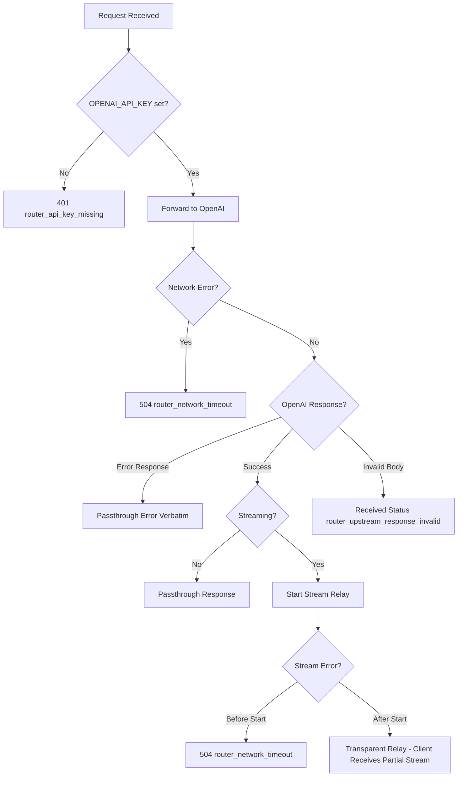
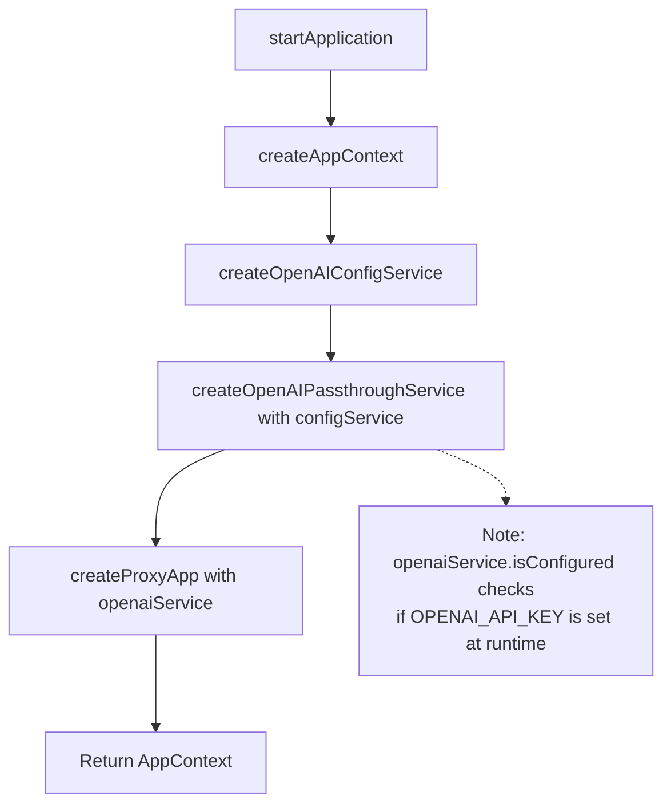
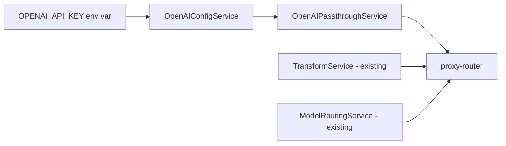

# 技術設計書: OpenAI Passthrough

## Overview

**Purpose**: OpenAI Passthrough ルーターは、OpenAI 互換クライアントからのリクエストを `model` 名に基づいて Antigravity または OpenAI API に自動で振り分ける機能を提供する。これにより、クライアントは単一のエンドポイント設定で複数のプロバイダーのモデルをシームレスに利用できるようになる。

**Users**: Codex CLI ユーザーおよび OpenAI 互換クライアントを使用する開発者が、設定変更なしで Gemini/Claude（Antigravity経由）と GPT（OpenAI直接）の両方を利用できる。

**Impact**: 既存の `/v1/chat/completions` エンドポイントに分岐ロジックを追加し、新しい `OpenAIPassthroughService` を導入する。既存の Antigravity 変換フローへの影響は最小限。

### Goals
- `model` 名に基づく自動ルーティング（gemini/claude → Antigravity、その他 → 上位サーバー）
- 上位サーバー（OpenAI API 等）へのリクエスト/レスポンスの透過的なパススルー（スキーマ変換なし）
- サーバー側 `OPENAI_API_KEY` による認証管理、または Auth Passthrough モードによるクライアント認証の転送
- `OPENAI_BASE_URL` による接続先のカスタマイズ（デフォルト: `https://api.openai.com`）
- OpenAI 互換エラーレスポンスの一貫した提供

### Non-Goals
- `/v1/models` エンドポイントへの OpenAI モデル追加（フォローアップタスク）
- OpenAI API からの動的モデル取得
- 複数の OpenAI API キーのサポート

## Architecture

> 詳細なディスカバリー結果は `research.md` を参照。本設計書は自己完結したレビューアーティファクトとして必要な判断と契約を記載する。

### Existing Architecture Analysis

現在のアーキテクチャは以下のパターンに従っている:

- **DI パターン**: ファクトリー関数 (`createProxyApp`, `createTransformService`) で依存性注入
- **責務分離**: Router（ルーティング）、Service（ビジネスロジック）、Transformer（変換）
- **Result 型**: `{ ok: true, value: T } | { ok: false, error: E }` による明示的エラーハンドリング

**Integration Points**:
- `proxy-router.ts`: リクエスト受付・バリデーション・ルーティング
- `TransformService`: Antigravity プロトコル変換・送信
- `ModelRoutingService`: モデルエイリアス解決

### Architecture Pattern & Boundary Map


#### Architecture Integration

- **Selected pattern**: Router レベル分岐 — 責務が明確で既存フローへの影響最小
- **Domain boundaries**: TransformService は Antigravity 専用、OpenAIPassthroughService は OpenAI 専用
- **Existing patterns preserved**: DI パターン、Result 型、ファクトリー関数
- **New components rationale**: OpenAI への透過中継は Antigravity 変換と根本的に異なるため専用サービスが必要
- **Steering compliance**: Hono、Zod、Bun ランタイム、ファクトリー関数パターンを維持

### Technology Stack

| Layer | Choice / Version | Role in Feature | Notes |
|-------|------------------|-----------------|-------|
| Backend / Services | Hono ^4.0 | HTTP ルーティング・リクエスト処理 | 既存スタック |
| Backend / Services | Zod ^3.22 | リクエストバリデーション | 既存スキーマ再利用 |
| Infrastructure / Runtime | Bun >=1.2.19 | HTTP クライアント (fetch)、サーバー | 既存スタック |

> 新規依存の追加なし。既存の `fetch` API を使用して OpenAI API と通信する。

## System Flows

### Request Routing Flow


#### Key Decisions

- エイリアス解決（ModelRoutingService）はルーティング判定**前**に実行
- ルーティング判定は解決後の `model` フィールドを使用
- OpenAI パスの場合は `Result<T, E>` ではなく直接 `Response` を返却（透過性のため）

### Error Handling Flow



#### ストリーミングエラーハンドリングの詳細

**ストリーム開始前のエラー**:
- ネットワークエラー、タイムアウト、OpenAI からの即座のエラーレスポンスは通常の HTTP エラーとして処理
- クライアントは標準的な JSON エラーレスポンスを受信

**ストリーム開始後のエラー**:
- OpenAI が SSE ストリーム内に `data: [DONE]` 以外のエラーメッセージを送信する場合、そのまま透過中継
- 接続が途中で切断された場合:
  - クライアントは不完全なストリームを受信（最後の `data: [DONE]` を受信しない）
  - ルーターは介入せず、クライアント側でタイムアウトまたは接続切断を検出
- **設計判断**: 透過性を優先し、ストリーム開始後のエラー処理をクライアントに委譲

## Requirements Traceability

| Requirement | Summary | Components | Interfaces | Flows |
|-------------|---------|------------|------------|-------|
| 1.1, 1.2, 1.3, 1.4, 1.5 | OPENAI_API_KEY/OPENAI_BASE_URL 環境変数管理、Auth Passthrough | OpenAIConfigService, main.ts | getApiKey(), getBaseUrl(), isConfigured() | Initialization |
| 2.1, 2.2, 2.3 | モデル名によるルーティング | shouldRouteToOpenAI, proxy-router | - | Request Routing |
| 3.1, 3.2, 3.3, 3.4 | パススルー忠実性 | OpenAIPassthroughService | handleCompletion() | Request Routing |
| 4.1-4.4 | エラー処理 | OpenAIPassthroughService | createOpenAIError() | Error Handling |
| 5.1, 5.2, 5.3 | 透過性・設定簡素化 | proxy-router, main.ts | - | Request Routing, Initialization |

## Components and Interfaces

| Component | Domain/Layer | Intent | Req Coverage | Key Dependencies | Contracts |
|-----------|--------------|--------|--------------|------------------|-----------|
| OpenAIPassthroughService | proxy | 上位サーバーへのリクエスト透過転送 | 3.1-3.4, 4.1-4.4 | OpenAIConfigService (P0 - injected), fetch (P0) | Service |
| OpenAIConfigService | config | OPENAI_API_KEY/OPENAI_BASE_URL の提供 | 1.1-1.5 | 環境変数 (P0) | Service |
| shouldRouteToOpenAI | proxy | モデル名に基づくルート判定 | 2.1, 2.2 | - | Utility |
| proxy-router (拡張) | proxy | ルーティング分岐の追加 | 2.1-2.3, 5.1-5.3 | OpenAIPassthroughService (P0), TransformService (P0) | - |
| main.ts (拡張) | bootstrap | サービス初期化とワイアリング | 1.1-1.5, 5.1-5.3 | OpenAIConfigService (P0), OpenAIPassthroughService (P0) | - |

### Proxy Layer

#### OpenAIPassthroughService

| Field | Detail |
|-------|--------|
| Intent | 上位サーバー（OpenAI API 等）へのリクエスト透過転送とレスポンス中継 |
| Requirements | 3.1, 3.2, 3.3, 3.4, 4.1, 4.2, 4.3, 4.4 |

##### Responsibilities & Constraints

- 上位サーバー（`OPENAI_BASE_URL` または `https://api.openai.com`）への HTTP リクエスト送信
- リクエストボディのスキーマ変換を行わない
- **認証ヘッダーの処理** (Requirement 1.2, 1.5, 3.2):
  - **Server Auth モード** (`OPENAI_API_KEY` が設定されている場合): クライアントの `Authorization` ヘッダーを無視し、サーバー側の API キーを使用
  - **Auth Passthrough モード** (`OPENAI_API_KEY` が未設定の場合): クライアントの `Authorization` ヘッダーをそのまま転送
  - 認証エラー（401）は上流サーバーからの応答として透過的に返却され、このサービス自体は認証エラーを生成しない
- ストリーミング応答の透過中継
- 上流エラーの忠実な伝達

##### Dependencies

- Inbound: proxy-router — 上位サーバールートのリクエスト処理 (P0)
- Outbound: 上位サーバー（OpenAI API 等） — Chat Completions エンドポイント (P0)
- External: OpenAIConfigService — API キー・接続先 URL 取得 (P0)

##### Service Interface

```typescript
interface OpenAIPassthroughService {
  handleCompletion(
    originalRequest: Request,
    body: ChatCompletionRequest
  ): Promise<Response>;
}

interface CreateOpenAIPassthroughServiceOptions {
  configService: OpenAIConfigService;
  logger?: Logger;
  timeout?: number; // default: 60000 (ms)
}

function createOpenAIPassthroughService(
  options: CreateOpenAIPassthroughServiceOptions
): OpenAIPassthroughService;
```

- **Preconditions**: `configService` が提供されること
- **Postconditions**:
  - 上位サーバーへのリクエストが送信され、レスポンスが返却される
- **Invariants**:
  - リクエスト/レスポンスボディはスキーマ変換されない
  - 接続先 URL は `configService.getBaseUrl()` から取得
  - API キーは `configService.getApiKey()` から取得（未設定時はクライアントヘッダーを使用）

##### Implementation Notes

- **Preconditions (Router Context)**:
  - `proxy-router` により、リクエストは既に `ChatCompletionRequestSchema` でバリデーション済みであることが保証されている。
  - したがって、`body` は常に有効な JSON オブジェクトであり、`model` フィールドは必ず存在する。
  - `Content-Type` が `application/json` 以外、または不正な JSON の場合は Router レベルで 400 エラーとなり、このサービスには到達しない。

- **Integration**:
  - `fetch` API を使用して上位サーバーと通信
  - 接続先 URL は `configService.getBaseUrl()` から取得
  - **認証ヘッダーの決定ロジック**:
    ```typescript
    const apiKey = configService.getApiKey();
    const authHeader = apiKey
      ? `Bearer ${apiKey}`
      : originalRequest.headers.get("Authorization");
    ```
  - **Implementation Detail (Passthrough Logic)**:
    - **Header**:
      - `Host`: 削除（Fetch が自動設定）
      - `Content-Length`: 削除（Fetch が自動設定）
      - その他のヘッダー: 元リクエストからコピー
      - `Authorization`: 上記ロジックに従って設定
    - **Body**:
      - Router でパース済みの `body` を `JSON.stringify(body)` で再シリアライズして送信。
      - これにより、不正な JSON のサニタイズと、Transfer-Encoding: chunked の適切な処理を保証する。
    - **Response**:
      - `fetch` の戻り値 `Response` オブジェクトを、新しい `Response` オブジェクトとしてラップして返却する。
      - Status, StatusText, Headers, Body (Stream) をすべてコピーする。
      - これにより、成功応答だけでなく、4xx/5xx エラー応答も完全に透過的にクライアントへ返却される。
  - **ストリーミングエラーハンドリング**:
    - ストリーム開始前のエラー（ネットワークエラー、タイムアウト）: 標準的な HTTP エラーレスポンスとして返却（504 など）
    - ストリーム開始後のエラー: 上位サーバーが SSE ストリーム内でエラーイベントを送信する場合、そのまま透過中継
    - ストリーム途中での接続切断: クライアントは不完全なストリームを受信（透過中継のため、ルーターは介入しない）
    - タイムアウト検出: `fetch` の `signal` オプションに `AbortSignal.timeout()` を使用し、ストリーム開始前のタイムアウトのみ検出（開始後のタイムアウトは検出しない）
- **Validation**:
  - `model` フィールドの存在チェックは Router 側で実施済み
- **Risks**:
  - 上位サーバーのレート制限 — `Retry-After` ヘッダーを透過
  - ストリーム中断の検出不可 — 透過中継のため、ルーターレベルでの検出・ロギングは困難

---

### Config Layer

#### OpenAIConfigService

| Field | Detail |
|-------|--------|
| Intent | OpenAI 関連の環境変数からの設定取得と提供 |
| Requirements | 1.1, 1.2, 1.3, 1.4, 1.5 |

##### Responsibilities & Constraints

- `OPENAI_API_KEY` 環境変数の読み込み
- `OPENAI_BASE_URL` 環境変数の読み込み（デフォルト: `https://api.openai.com`）
- API キーの存在チェック（認証モード判定のため）
- キーをクライアントに露出しない
- **重要**: `isConfigured()` が `false` を返してもエラーではなく、Auth Passthrough モードで動作することを意味する

##### Dependencies

- Inbound: main.ts (起動時), OpenAIPassthroughService — 設定取得 (P0)
- External: 環境変数 `OPENAI_API_KEY`, `OPENAI_BASE_URL` (P0)

##### Service Interface

```typescript
interface OpenAIConfigService {
  getApiKey(): string | undefined;
  getBaseUrl(): string;
  isConfigured(): boolean;
}

function createOpenAIConfigService(): OpenAIConfigService;
```

- **Preconditions**: なし
- **Postconditions**:
  - `getApiKey()`: 環境変数から読み取った値を返却（未設定なら `undefined`）
  - `getBaseUrl()`: `OPENAI_BASE_URL` の値、または未設定時は `"https://api.openai.com"`
  - `isConfigured()`: `OPENAI_API_KEY` が設定されている場合 `true`（Server Auth モード）、未設定の場合 `false`（Auth Passthrough モード）
- **Invariants**: 環境変数はプロセス起動時から変更されない前提

---

### Utility Layer

#### shouldRouteToOpenAI

| Field | Detail |
|-------|--------|
| Intent | モデル名に基づく OpenAI ルートへの振り分け判定 |
| Requirements | 2.1, 2.2 |

##### Service Interface

```typescript
function shouldRouteToOpenAI(model: string): boolean;
```

**Logic**:
- `model` 名（小文字変換後）に `"gemini"` または `"claude"` が含まれる → `false`（Antigravity）
- 上記以外 → `true`（OpenAI）

- **Preconditions**: `model` が空でないこと（Router でバリデーション済み）
- **Postconditions**: 真偽値を返却
- **Invariants**: 純粋関数（副作用なし）

---

## Service Initialization and Wiring

### Initialization Flow

OpenAI Passthrough 機能のサービス初期化は、既存の `main.ts` の `createAppContext` 関数に統合される。初期化順序は以下の通り:



### Dependency Graph



### Component Initialization Responsibilities

| Component | Created By | Initialization Location | Ownership | Notes |
|-----------|-----------|------------------------|-----------|-------|
| OpenAIConfigService | createOpenAIConfigService() | createAppContext() in main.ts | AppContext | Always created |
| OpenAIPassthroughService | createOpenAIPassthroughService({configService, ...}) | createAppContext() in main.ts | AppContext | Always created; receives OpenAIConfigService as dependency |
| proxy-router (updated) | createProxyApp(options) | createAppContext() in main.ts | AppContext | Receives OpenAIPassthroughService via options |

### Implementation in main.ts

#### Type Definitions

```typescript
// AppContext への追加
export type AppContext = {
  authApp: Hono;
  proxyApp: Hono;
  tokenStore: FileTokenStore;
  authService: OAuthAuthService;
  transformService: TransformService;
  modelAliasConfigService?: ModelAliasConfigService;
  modelRoutingService?: ModelRoutingService;
  openaiConfigService?: OpenAIConfigService;        // New
  openaiService?: OpenAIPassthroughService;          // New
};
```

#### createAppContext 拡張

```typescript
export function createAppContext(options: CreateAppContextOptions = {}): AppContext {
  const logger = options.logger ?? NOOP_LOGGER;
  const modelCatalog = options.modelCatalog;
  const modelAliasConfigService = options.modelAliasConfigService;
  const buildProxyApp = options.createProxyApp ?? createProxyApp;
  initializeRuntime();

  // Existing services
  const tokenStore = new FileTokenStore({ logger });
  const authService = new OAuthAuthService({ tokenStore });
  const requester = createAntigravityRequester({ logger });
  const transformService = createTransformService({ tokenStore, requester });
  const authApp = createAuthApp(authService);
  const modelRoutingService = modelAliasConfigService
    ? createModelRoutingService({ aliasConfig: modelAliasConfigService, logger })
    : undefined;

  // New: OpenAI services initialization
  const openaiConfigService = createOpenAIConfigService();
  const openaiService = createOpenAIPassthroughService({
    configService: openaiConfigService,
    logger,
  });

  // Logging
  if (openaiConfigService.isConfigured()) {
    logger.info("OpenAI passthrough service initialized with server API key");
  } else {
    logger.info("OpenAI passthrough service initialized in Auth Passthrough mode (client Authorization header will be used)");
  }
  logger.debug(`OpenAI base URL: ${openaiConfigService.getBaseUrl()}`);

  // Proxy app with openaiService
  const proxyApp = buildProxyApp({
    transformService,
    modelCatalog,
    modelRoutingService,
    openaiService,  // New
  });

  return {
    authApp,
    proxyApp,
    tokenStore,
    authService,
    transformService,
    modelAliasConfigService,
    modelRoutingService,
    openaiConfigService,  // New
    openaiService,        // New
  };
}
```

#### Key Design Decisions

1. **Dependency Injection Pattern**:
   - `OpenAIPassthroughService` は `OpenAIConfigService` への依存を `CreateOpenAIPassthroughServiceOptions.configService` で受け取る
   - 設定の取得は `configService.getApiKey()` と `configService.getBaseUrl()` に委譲
   - これにより、設定状態の単一責任が `OpenAIConfigService` に保たれる

2. **Always Initialize Services**:
   - `OpenAIConfigService` と `OpenAIPassthroughService` は両方とも常に作成される
   - `OPENAI_API_KEY` 未設定時も起動は継続し、Auth Passthrough モードで動作
   - これにより、Antigravity のみを使用するユーザーは `OPENAI_API_KEY` を設定する必要がない

3. **Wiring Responsibility**:
   - `main.ts` の `createAppContext` がすべてのサービスの初期化と依存関係の構築を担当
   - 既存パターン（例: `ModelRoutingService` への `ModelAliasConfigService` 注入）との一貫性を維持

4. **Runtime Authentication Mode**:
   - `OPENAI_API_KEY` が設定されている場合、サーバー側のキーを使用（Server Auth モード）
   - `OPENAI_API_KEY` が未設定の場合、クライアントの `Authorization` ヘッダーを転送（Auth Passthrough モード）
   - `OpenAIConfigService.isConfigured()` は認証モードの判定に使用され、未設定=エラーではなく、未設定=Passthrough モード
   - Router は認証エラーを返さず、OpenAIPassthroughService が適切なヘッダーを設定して上流サーバーに転送

5. **Testing Seam**:
   - `CreateAppContextOptions` を通じたファクトリー注入により、テスト時にモックサービスを注入可能
   - `OpenAIConfigService` のモックにより、API キー設定/未設定の両方のシナリオをテスト可能

---

### Router Extension

#### proxy-router.ts 拡張

| Field | Detail |
|-------|--------|
| Intent | ルーティング分岐ロジックの追加 |
| Requirements | 2.1, 2.2, 2.3, 5.1, 5.2, 5.3 |

##### Changes Required

1. `CreateProxyAppOptions` に `openaiService?: OpenAIPassthroughService` を追加
2. `POST /v1/chat/completions` ハンドラー内で分岐ロジックを追加

```typescript
// CreateProxyAppOptions 拡張
export interface CreateProxyAppOptions {
  transformService: TransformService;
  modelCatalog?: ModelCatalog;
  modelRoutingService?: ModelRoutingService;
  openaiService?: OpenAIPassthroughService; // New
}

// ハンドラー内分岐ロジック（概念）
const routingResult = options.modelRoutingService?.route(parsed.data);
const routedRequest = routingResult?.request ?? parsed.data;

if (shouldRouteToOpenAI(routedRequest.model)) {
  // 上位サーバールート (OpenAI Passthrough)
  // OpenAIConfigService.isConfigured() に基づき、以下のいずれかのモードで動作:
  // - Server Auth モード: サーバー側の OPENAI_API_KEY を使用
  // - Auth Passthrough モード: クライアントの Authorization ヘッダーを転送
  // 認証処理は openaiService 内部で完結し、Router は認証エラーを返さない
  return options.openaiService.handleCompletion(c.req.raw, routedRequest);
}
// Antigravity ルート
  // 既存 Antigravity フロー
  const result = normalizeTransformResult(
    await options.transformService.handleCompletion(routedRequest)
  );
  // ... existing error handling
}

/**
 * モデル名に基づくルーティング判定ロジック
 * 判定基準:
 * 1. "gemini" (大文字小文字無視) を含む -> Antigravity
 * 2. "claude" (大文字小文字無視) を含む -> Antigravity
 * 3. それ以外 -> 上位サーバー (OpenAI Passthrough)
 */
function shouldRouteToOpenAI(model: string): boolean {
  const normalized = model.toLowerCase();
  if (normalized.includes("gemini")) return false;
  if (normalized.includes("claude")) return false;
  return true;
}
```

##### Implementation Notes

- **Integration**:
  - 既存の `ModelRoutingService` によるエイリアス解決後にルーティング判定
  - `openaiService` が未導入の場合、OpenAI 対象モデルに対するリクエストは適切なエラーハンドリングが必要
- **Validation**: 
  - **Requirement 2.3: strict model validation**:
    スキーマパースの直前または直後に以下の明示的なチェックを追加し、要件通りのエラーメッセージと `param` フィールドを保証する。
    ```typescript
    const model = payload.model;
    if (model === undefined || model === null || model === "") {
      return c.json(createOpenAIError(
        "Missing required parameter: 'model'",
        "invalid_request_error",
        null,
        "model"
      ), 400);
    }
    ```
- **Risks**: 
  - なし（ルーティング判定により、Antigravity フローへの予期せぬ影響は排除される）

## Data Models

### Domain Model

本機能は新しいドメインモデルを導入しない。既存の `ChatCompletionRequest` スキーマを再利用する。

### Request/Response パススルー

OpenAI パススルーではスキーマ変換を行わないため、データモデルの定義は不要。クライアントからのリクエストボディと OpenAI からのレスポンスボディはそのまま中継される。

### Data Contracts & Integration

#### API Data Transfer

**上位サーバー API Request**:
- Endpoint: `POST {OPENAI_BASE_URL}/v1/chat/completions` (デフォルト: `https://api.openai.com/v1/chat/completions`)
- Headers:
  - `Authorization`: `OPENAI_API_KEY` が設定されている場合は `Bearer {OPENAI_API_KEY}`、未設定の場合はクライアントの `Authorization` ヘッダーをそのまま転送
  - `Content-Type: application/json`
  - その他クライアントヘッダーを保持（`Host`, `Content-Length` を除く）
- Body: クライアントからのリクエストボディをそのまま転送

**上位サーバー API Response**:
- ステータスコードとボディをそのまま返却
- ストリーミング時: `text/event-stream` をそのまま中継

## Error Handling

### Error Strategy

OpenAI パススルーのエラー処理は以下の方針に従う:

1. **ルーター側エラー**: 明確な識別子 (`code`) を付与した OpenAI 互換形式
2. **上流エラー**: 上位サーバーからのレスポンスをそのまま返却（verbatim）
3. **ネットワークエラー**: 504 Gateway Timeout として正規化
4. **ストリーミングエラー**:
   - ストリーム開始前: 通常の HTTP エラーレスポンス（JSON 形式）
   - ストリーム開始後: 透過中継を維持し、クライアント側で処理

### Error Categories and Responses

#### Router-Side Errors (4xx/5xx)

| Error Scenario | HTTP Status | Error Code | Message | Streaming Behavior |
|----------------|-------------|------------|---------|-------------------|
| model フィールド欠損 (Req 2.3) | 400 | `null` | Missing required parameter: 'model' | N/A (occurs before stream) |
| ネットワークタイムアウト (Req 4.2) | 504 | `router_network_timeout` | Failed to connect to upstream API: network timeout | Only detectable before stream starts |
| 内部エラー (Req 4.3) | 500 | `router_internal_error` | Internal router error occurred while processing upstream request | Only detectable before stream starts |
| 上流レスポンス不正 (Req 4.4) | (受信ステータス) | `router_upstream_response_invalid` | Upstream server returned an invalid or unparseable response | Only for non-streaming responses |

#### Upstream Errors (Passthrough)

上位サーバーからのエラーレスポンス（401, 429, 500, 503 など）はステータスコードとボディをそのまま返却する。
Note: Auth Passthrough モードでクライアントのキーが無効な場合、上位サーバーからの 401 エラーがそのままクライアントに返される。

```typescript
// Error Response Helper
interface OpenAIErrorResponse {
  error: {
    message: string;
    type: string;
    param: string | null;
    code: string | null;
  };
}

function createOpenAIError(
  message: string,
  type: string,
  code: string | null,
  param?: string | null
): OpenAIErrorResponse {
  return {
    error: {
      message,
      type,
      param: param ?? null,
      code,
    },
  };
}
```

### Monitoring

- **Logging**: 
  - ルーティング判定結果（DEBUG レベル）
  - OpenAI API へのリクエスト/レスポンスメタデータ（INFO レベル）
  - エラー発生時の詳細（ERROR レベル）
- **Metrics** (将来の検討事項):
  - ルート別リクエスト数
  - OpenAI API レイテンシ
  - エラー率

## Testing Strategy

### Unit Tests

1. **shouldRouteToOpenAI**: 各モデル名パターンでの正しいルート判定
2. **OpenAIConfigService**: 環境変数設定/未設定時の動作
3. **createOpenAIError**: エラーレスポンス形式の正確性
4. **ヘッダー処理**: Authorization 上書き、Host 除外、その他保持

### Integration Tests

1. **Antigravity ルート**: gemini/claude モデルが TransformService に流れること
2. **OpenAI ルート**: gpt モデルが OpenAIPassthroughService に流れること
3. **エラー伝播**: OPENAI_API_KEY 未設定時の 401 レスポンス
4. **既存機能の回帰**: ModelRoutingService によるエイリアス解決が維持されること

### E2E Tests (環境変数 `RUN_E2E=1` で有効化)

1. **OpenAI API 統合**: 実際の OpenAI API へのリクエスト/レスポンス
2. **ストリーミング**:
   - SSE ストリームの透過中継
   - ストリーム開始前のタイムアウトエラー検出
   - ストリーム完了（`data: [DONE]` 受信）の確認
3. **エラーケース**:
   - 無効な API キーでの 401 パススルー
   - ネットワークタイムアウトでの 504 エラー

### Performance

1. **レイテンシ**: パススルーによる追加レイテンシが 50ms 未満であること
2. **メモリ**: ストリーミング時のメモリ使用量が一定であること

## Security Considerations

### API Key Management

- `OPENAI_API_KEY` はサーバー環境変数で管理
- ログ出力時にキーをマスク
- クライアントからの `Authorization` ヘッダーは無視（上書き）
- キーがレスポンスに露出しないことを確認

### Request Validation

- 既存の Zod スキーマによるリクエストバリデーションを維持
- 大きすぎるリクエストボディに対する制限（Hono のデフォルト制限を利用）

## Performance & Scalability

### Target Metrics

- **追加レイテンシ**: < 50ms（ルーティング判定のみ）
- **スループット**: 既存パフォーマンスを維持

### Streaming Optimization

- `ReadableStream` をそのまま中継することでメモリ使用量を最小化
- バッファリングなしの透過転送

## Supporting References

詳細なディスカバリー結果、アーキテクチャ評価、および設計判断の詳細な根拠は `research.md` を参照。
